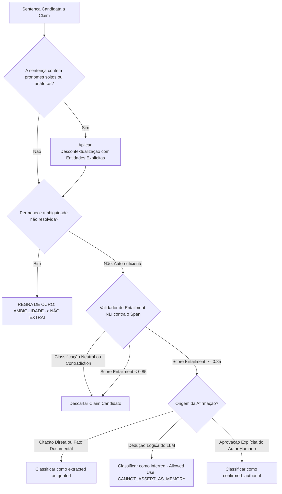

# Protocolo de Claims & Linhagem de Proveniência — Cérebro Reflex V3.1

Este guia operacional orienta o Agente A5 e os motores cognitivos na extração atômica de afirmações, desambiguação e prevenção de vazamento de inferência (**MILR**).

---

## 1. Árvore de Decisão de Extração (Decision Tree)

---

## 2. Regras de Decisão Operacional

### Regra 1: O Teste de Ambiguidade
- **SE** a proposição depende de interpretação subjetiva de termos indeterminados (*"coisas"*, *"certos autores"*, *"naquele período"* sem datação):
  - **STOP: NÃO EXTRAIR O CLAIM**. O chunk original permanece preservado para leitura humana na biblioteca.

### Regra 2: A Fronteira entre Memória e Inferência
- **SE** uma afirmação for gerada por extrapolação de modelo de linguagem:
  1. Atribuir obrigatoriamente `epistemic_status = 'inferred'`;
  2. Adicionar tag `allowed_use = ['CAN_INSPIRE_QUESTION', 'CAN_BE_MENTIONED_AS_POSSIBLE_DEDUCTION']`;
  3. **NUNCA** permitir prefixos de rememoração (*"Você sempre..."*, *"Lembro que você prefere..."*).

### Regra 3: Rastreabilidade de Linhagem (Lineage)
- Todo claim aceito deve carregar:
  - `source_id` (UUID do documento original);
  - `chunk_id` (UUID do fragmento leitor);
  - `span_exato` (texto literal exato do trecho de suporte);
  - `offsets` (início e fim no documento);
  - `entailment_score` (grau de sustentação inferencial).
