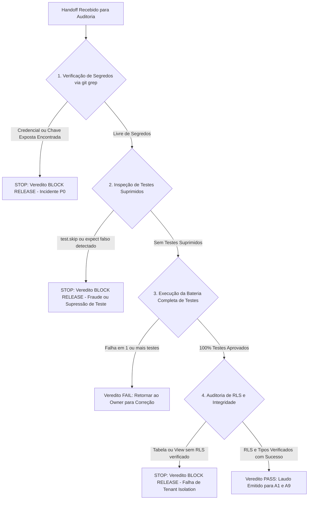

# Protocolo de Auditoria Independente Zero-Trust — AppSec & QA

Este protocolo normativo orienta o Agente A7 na auditoria independente de todas as entregas de código do App Reflex 02.

---

## 1. Árvore de Decisão do Auditor (Decision Tree)

---

## 2. Regras de Decisão por Cenário de Falha

### Cenário 1: Presença de Segredos Versionados
- **SE** qualquer arquivo contiver chave de serviço, senha de banco ou token de autenticação:
  1. Emitir imediatamente veredito **`BLOCK RELEASE`**;
  2. Notificar A1 e A9 para registro de Incidente de Segurança;
  3. **STOP: Não aprovar PR sob nenhuma circunstância**.

### Cenário 2: Testes Suprimidos ou Ignorados (`test.skip`)
- **SE** o desenvolvedor desativou testes que falhavam utilizando `test.skip`, `// @ts-ignore` ou `eslint-disable` sem justificativa arquitetural prévia:
  1. Emitir veredito **`BLOCK RELEASE`**;
  2. **STOP: Exigir a resolução da causa-raiz do teste quebrado**.

### Cenário 3: Falha Funcional ou Regressão
- **SE** qualquer teste automatizado falhar durante `npm test`:
  1. Capturar o stack trace e o teste específico;
  2. Emitir veredito **`FAIL`** com o relatório detalhado do ponto de falha;
  3. Devolver o Task Packet ao especialista implementador (sem corrigir silenciosamente).

### Cenário 4: Aprovação Completa
- **SE** `tsc --noEmit` = 0 erros, `npm run lint` = 0 erros, 100% dos testes Vitest passando e nenhuma vulnerabilidade identificada:
  1. Emitir veredito **`PASS`** com o resumo de execução no Output Contract.
