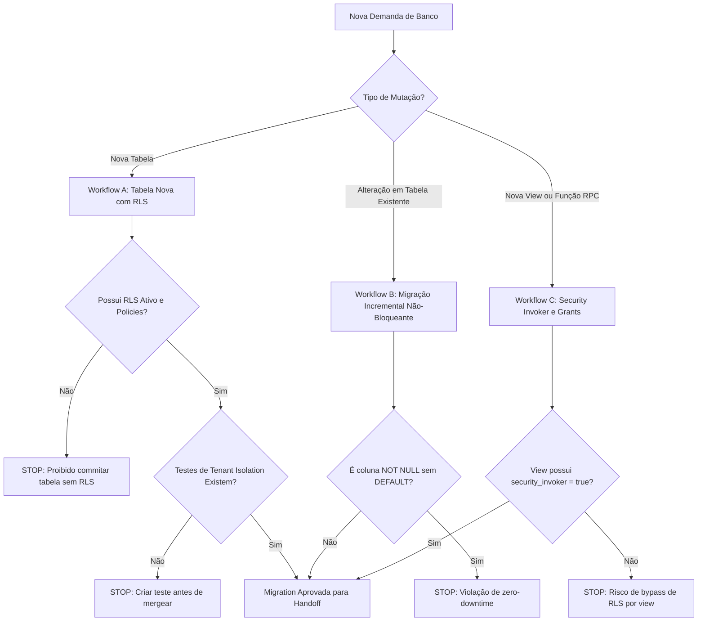

# Safe Migrations & RLS Protocol — Supabase PostgreSQL 17

Este guia normativo orienta o Agente A4 e auditores na criação e validação de migrações relacionais seguras no App Reflex 02.

---

## 1. Árvore de Decisão Operacional (Decision Tree)



---

## 2. Regras de Decisão por Cenário

### Cenário A: Criação de Nova Tabela
- **SE** a operação cria uma nova tabela:
  1. Utilizar `CREATE TABLE IF NOT EXISTS <schema>.<tabela> (...);`;
  2. Executar obrigatoriamente `ALTER TABLE <schema>.<tabela> ENABLE ROW LEVEL SECURITY;`;
  3. Criar policies explícitas separadas para `SELECT`, `INSERT`, `UPDATE` e `DELETE`;
  4. Atribuir grants mínimos (`GRANT SELECT, INSERT, UPDATE, DELETE ON <schema>.<tabela> TO authenticated;`);
  5. Criar índices em todas as chaves estrangeiras (`FK`) e no campo `autor_id`;
  6. **SE** não houver teste de isolamento cobrindo a nova tabela $\to$ **STOP: Requisite teste a A7**.

### Cenário B: Alteração de Tabela Existente
- **SE** a operação adiciona coluna:
  1. `ALTER TABLE ... ADD COLUMN IF NOT EXISTS ...;`;
  2. **NUNCA** adicionar coluna `NOT NULL` sem valor `DEFAULT` em tabelas existentes;
  3. **NUNCA** renomear ou remover colunas em uso sem plano de depreciação em 2 etapas.

### Cenário C: Criação de Views e Funções (RPC)
- **SE** a operação cria uma VIEW:
  1. Toda view criada DEVE conter `WITH (security_invoker = true);` para respeitar as políticas de RLS do usuário que consulta;
  2. Proibido criar views com `security_definer` sem aprovação expressa do Arquiteto A1.

---

## 3. Template Canônico de Migration Idempotente

```sql
-- Migration: 00XX_nome_descritivo.sql
-- Descrição: Criação da tabela X com isolamento de autor

CREATE TABLE IF NOT EXISTS public.minha_tabela (
    id UUID PRIMARY KEY DEFAULT gen_random_uuid(),
    autor_id UUID NOT NULL REFERENCES auth.users(id) ON DELETE CASCADE,
    conteudo TEXT NOT NULL,
    metadata JSONB DEFAULT '{}'::jsonb,
    created_at TIMESTAMPTZ DEFAULT now(),
    updated_at TIMESTAMPTZ DEFAULT now()
);

-- Ativação compulsória de RLS
ALTER TABLE public.minha_tabela ENABLE ROW LEVEL SECURITY;

-- Políticas de RLS com granularidade por autor
DO $$ BEGIN
    IF NOT EXISTS (
        SELECT 1 FROM pg_policies 
        WHERE tablename = 'minha_tabela' AND policyname = 'minha_tabela_autor_select'
    ) THEN
        CREATE POLICY minha_tabela_autor_select ON public.minha_tabela
            FOR SELECT USING (auth.uid() = autor_id);
    END IF;
END $$;

-- Grants controlados
GRANT SELECT, INSERT, UPDATE, DELETE ON public.minha_tabela TO authenticated;
GRANT SELECT ON public.minha_tabela TO anon;

-- Índices de alta performance
CREATE INDEX IF NOT EXISTS idx_minha_tabela_autor ON public.minha_tabela(autor_id);
```
