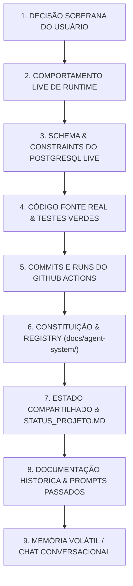

# HIERARQUIA DAS FONTES DE VERDADE — REFLEX AGENT OS V3
**Status:** Normativo e Canônico | **Repositório:** `villacanabrava-maker/App-Reflex-02` | **Data:** 19 de setembro de 2026

---

## 1. ORDEM DE PRECEDÊNCIA ABSOLUTA

Quando houver divergência entre arquivos, conversas, memórias ou suposições de agentes, a resolução deve obedecer rigorosamente à seguinte hierarquia decrescente de autoridade:

### Detalhamento dos Níveis de Autoridade

1. **Nível 1 — Decisão Soberana do Usuário:** Instrução explícita dada pelo usuário nesta sessão ou decisão formalizada em ADR aprovada.
2. **Nível 2 — Comportamento Live de Runtime:** A resposta observada em produção ou ambiente dev/test ativo (ex: status HTTP, deployment real da Vercel).
3. **Nível 3 — Schemas e Constraints do Banco Live:** A estrutura de tabelas, triggers, RLS e constraints aplicadas no Supabase (verificadas via `_migrations` e PostgREST schema profiles).
4. **Nível 4 — Código-Fonte Real e Testes:** O código TypeScript/SQL versionado e verificado localmente com `vitest`, `tsc` e `eslint`.
5. **Nível 5 — Histórico Canônico Git:** O commit HEAD canônico na branch `main` e o status das execuções no GitHub Actions.
6. **Nível 6 — Camada Runtime-Neutral:** As definições em `docs/agent-system/` (`CONSTITUTION.md`, `agent-registry.yaml`, schemas JSON).
7. **Nível 7 — Documentos de Continuidade:** `docs/coordenacao/ESTADO_COMPARTILHADO.md` e `docs/STATUS_PROJETO.md`.
8. **Nível 8 — Documentação Histórica:** Textos de missões passadas (`MIS-0001` a `MIS-0011`), notas de pesquisa e relatórios antigos. Se divergirem do código atual, devem ser marcados como obsoletos ou atualizados.
9. **Nível 9 — Memória Conversacional:** Resumos de chat, suposições implícitas ou alucinações de contexto. Possuem nível ZERO de autoridade normativa.

---

## 2. RECONCILIAÇÃO CONTRA DRIFT

Se um agente detectar que a documentação afirma algo inconsistente com o código real ou runtime:
- **NÃO** reverta o código funcional para adequá-lo à documentação obsoleta.
- **NÃO** silencie a discrepância.
- **AÇÃO OBRIGATÓRIA:** Emita evidência `[CONFIRMADO-RUNTIME]` ou `[CONFIRMADO-CODIGO]` e atualize o documento de estado compartilhado para refletir a realidade material do projeto.
