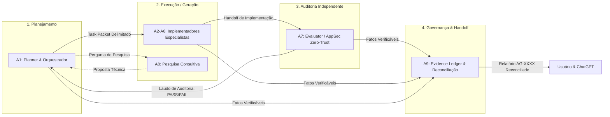

# ARQUITETURA MULTIAGENTE V2 — APP REFLEX 02
### O Harness Operacional, Especialização e Governança dos 9 Agentes Constitucionais
**Missão:** AGENT HARNESS V2 | **Status:** Normativo e Canônico | **Data:** 2026-09-18

---

## 1. Princípio Fundamental e Objetivo da Arquitetura V2

> **"O AGENTE CERTO com O CONTEXTO CERTO usando AS FERRAMENTAS CERTAS para UMA TAREFA DELIMITADA com UMA SAÍDA VERIFICÁVEL."**

A missão da **Arquitetura Multiagente V2** não é inflar o número de agentes nem fazer com que os 9 agentes atuem simultaneamente em todas as tarefas. Seu propósito central é:
- Eliminar a sobreposição de papéis e alucinações de autoridade;
- Aplicar o princípio do **Menor Privilégio (Least Privilege)** por agente;
- Garantir a separação entre quem **planeja (A1)**, quem **implementa (A2–A6)**, quem **audita (A7)**, quem **pesquisa (A8)** e quem **reconcilia a evidência (A9)**;
- Minimizar tokens e ruídos cognitivos através de **Task Packets** enxutos e tipados;
- Blindar o sistema contra comandos destrutivos e violações de escopo no ambiente operacional Windows.

---

## 2. A Constituição Canônica dos 9 Agentes

Cada agente possui identidade estrita, domínio delimitado e descrições discriminativas (afirmativas e negativas):

```
┌────────────────────────────────────────────────────────────────────────┐
│                   A1 — ARQUITETURA E COORDENAÇÃO                       │
│  (mainAgent: true | subagent: true)                                    │
│  Planner, regência geral, contratos de interface, aceitação e ADRs     │
└──────────────────┬──────────────────────────────────┬──────────────────┘
                   │                                  │
         ┌─────────┴─────────┐              ┌─────────┴─────────┐
         ▼                   ▼              ▼                   ▼
    A2 — DESIGN         A3 — FRONTEND   A4 — BACKEND         A5 — IA E
      E UX               (Next/React)    E SUPABASE        CONHECIMENTO
 (mainAgent: false)   (mainAgent: false)(mainAgent: false) (mainAgent: false)
 Interfaces, Tokens,   Engenharia de     PostgreSQL 17,    Claims, Schemas Zod,
 Acessibilidade        Páginas e         RLS, Migrations,  RAG, NLI Entailment,
 WCAG 2.2 AA           Componentes       Storage TUS       Memory Firewall
         │                   │              │                   │
         └─────────┬─────────┘              └─────────┬─────────┘
                   │                                  │
         ┌─────────┴─────────┐              ┌─────────┴─────────┐
         ▼                   ▼              ▼                   ▼
    A6 — PLATAFORMA     A7 — QUALIDADE  A8 — PESQUISA        A9 — CONTINUIDADE,
        E SRE           E SEGURANÇA     E EVOLUÇÃO           EVIDÊNCIA E COMUNICAÇÃO
 (mainAgent: false)   (mainAgent: false)(mainAgent: false) (mainAgent: false)
 CI/CD, GitHub         Auditor           Pesquisa com      Livro-razão de fatos,
 Actions, Git, SRE     Independente,     Evidências,       reconciliação de frentes,
 e Observabilidade     Zero-Trust, E2E   Benchmarks e      handoffs tripartite
                       e AppSec Gates    Diagnósticos      (Usuário ↔ CG ↔ AGY)
```

### Regra do Agente Principal (Main Agent):
- **A1 (`rflex-architect`)** é o **único** agente configurado com `mainAgent: true`, servindo de interface primária de coordenação com o usuário e o ChatGPT.
- **A2 a A9** são estritamente `mainAgent: false` e `subagent: true`, sendo acionados exclusivamente sob demanda pelo orquestrador A1.

---

## 3. O Triângulo de Separação de Poderes: Planner / Generator / Evaluator



### Regras Constitucionais Invioláveis:
1. **SELF_REVIEW $\neq$ INDEPENDENT_REVIEW:** O agente especialista que implementa uma alteração pode e deve fazer auto-revisão preliminar, mas ela **jamais substitui** a auditoria formal e independente de A7.
2. **A7 Não Corrige em Segredo:** A7 detecta, reprova, adiciona testes e aponta a causa do erro; ele **não corrige silenciosamente** o código do produto para depois auto-aprovar. A correção retorna ao agente owner.
3. **A1 Não é Superagente:** A1 não programa telas, não cria migrations e não executa auditorias; ele decompõe, delega e cobra evidências.
4. **A8 Não é Gerente:** A8 não comanda outros especialistas nem decide arquitetura; ele investiga e propõe opções com evidências.
5. **A9 Não Programa Lógica de Negócio:** A9 não toca em regras de aplicação; ele administra o livro-razão de fatos e audita desvios de escopo.

---

## 4. O Sistema de Task Packets (Context Isolation)

Subagentes operam em contextos isolados e limpos. Para evitar a poluição de contexto e a alucinação de dependências, A1 envia para cada subagente um **Task Packet** com o seguinte esquema estrito:

```yaml
mission_id: "MIS-0006"
task_id: "TSK-04-01"
owner: "rflex-backend-supabase"
goal: "Criar a tabela claims_ledger com RLS por autor_id"
why: "Atender ao requisito da Fase 1 da Arquitetura V3.1"
baseline_sha: "e269cd2995e127146afe94b1aa9c35c343f5bac5"
relevant_files:
  - "supabase/migrations/0030_sistema_rls_hardening.sql"
  - "docs/ia/ARQUITETURA_CLAIMS_PROVENANCE.md"
inputs:
  schema_spec: "docs/ia/ARQUITETURA_CLAIMS_PROVENANCE.md#secao-3"
contracts:
  - "Toda consulta deve usar security_invoker = true"
  - "Nenhum bypass de RLS é autorizado"
constraints:
  - "Criar migration incremental 0031_claims_ledger.sql"
  - "Tempo de execução da query < 10ms"
forbidden:
  - "Não alterar migrations anteriores"
  - "Não criar tabelas fora do schema canônico"
expected_outputs:
  - "supabase/migrations/0031_claims_ledger.sql"
  - "tests/seguranca/claims-rls.test.ts"
tests:
  - "npm test tests/seguranca/claims-rls.test.ts"
evidence_required:
  - "[CONFIRMADO-CODIGO]: migration presente"
  - "[CONFIRMADO-TESTE]: teste de tenant isolation passando"
stop_condition: "Migration criada e teste de isolamento verde"
handoff_to: "rflex-qa-security"
```

---

## 5. Matriz de Classificação de Evidências

Toda afirmação técnica emitida pelos agentes deve ser indexada por A9 sob a seguinte régua canônica:

| Tag de Evidência | Significado | Exemplo Aceito |
|---|---|---|
| `[CONFIRMADO-CODIGO]` | O código foi inspecionado diretamente no arquivo. | "Linha 42 de `src/lib/cerebro.ts` validada." |
| `[CONFIRMADO-TESTE]` | O teste foi executado e o stdout do Vitest foi capturado. | "74 testes passando em 20 arquivos em 18s." |
| `[CONFIRMADO-CI]` | O pipeline do GitHub Actions finalizou com sucesso. | "Run remota 35414164109 verde em 1m0s." |
| `[CONFIRMADO-RUNTIME]` | Verificação interativa no ambiente local em execução. | "Servidor Next.js respondeu 200 OK na rota /biblioteca." |
| `[CONFIRMADO-EXTERNAL]` | Fonte oficial, RFC ou documentação primária consultada. | "W3C SKOS Recommendation seção 4.2." |
| `[REPORTED]` | Declaração relatada pelo usuário ou agente ainda sem validação. | "Usuário reportou lentidão na rota." |
| `[INFERRED]` | Conclusão deduzida a partir de indícios, sem prova material. | "O arquivo parece ter sido gerado manualmente." |
| `[PENDING]` | Ação em andamento que aguarda confirmação. | "Aguardando término da migration." |
| `[BLOCKED]` | Ação impedida por falta de evidência ou restrição ativa. | "Bloqueado: aguardando rotação de senha no Supabase." |

---

## 6. Governança Específica do Ambiente Windows

No Windows, o Antigravity opera diretamente no shell **PowerShell (pwsh)** do sistema operacional.  
Ao contrário de ambientes Linux conteinerizados, o isolamento depende de três camadas coordenadas:

1. **PreToolUse Hook (`pre-tool-guard.js`):** Script em Node.js intercepta chamadas de `run_command` antes da execução, bloqueando chamadas destrutivas (`rm -rf`, `drop database`, force push, e chamadas indevidas ao Vercel).
2. **Stop Audit Hook (`stop-audit-guard.js`):** Valida a presença de evidências antes de encerrar o ciclo do agente.
3. **Verificação Independente de A7 & Testes Vitest:** Garantia de que nenhuma alteração quebra permissões ou segredos através de suítes de teste de segurança que rodam em 6ms a 200ms.
