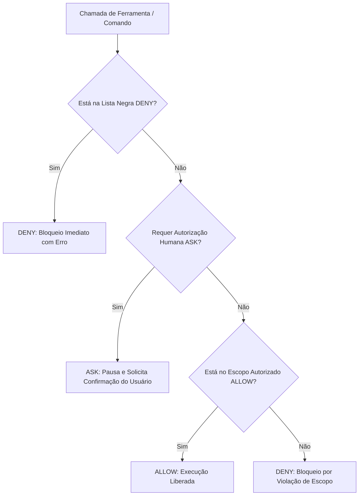

# MATRIZ DE PERMISSÕES E POLÍTICA DE SEGURANÇA — APP REFLEX 02
### Controle de Menor Privilégio, Hierarquia DENY > ASK > ALLOW e Governança Windows
**Missão:** AGENT HARNESS V2 | **Status:** Normativo e Canônico | **Data:** 2026-09-18

---

## 1. Princípio do Menor Privilégio (Least Privilege)

Nenhum agente possui acesso irrestrito a ferramentas ou comandos do sistema operacional. Cada agente recebe exclusivamente as ferramentas necessárias para o cumprimento de sua missão especializada.

---

## 2. Matriz Geral de Permissões por Agente

| Agente | Arquivos (Read) | Arquivos (Write) | Rede Externa | MCP Servers | Comandos Shell (`run_command`) | Nível de Modelo |
|---|:---:|:---:|:---:|:---:|:---:|:---:|
| **A1 (Arquitetura)** | Amplo (Todo o Repo) | `docs/adr/**`, `docs/planos/**` | Restrita | Nenhum | Leitura / Git Status | `pro` / `inherit` |
| **A2 (Design & UX)** | `src/**`, `docs/**` | `src/estilos/**`, tokens | Web (Figma/W3C) | Nenhum | Build local / Testes A11y | `flash` / `pro` |
| **A3 (Frontend)** | `src/**`, `package.json` | `src/componentes/**`, `src/app/**` | Nenhuma | Nenhum | `npm run lint`, `npm test` | `flash` / `pro` |
| **A4 (Backend Supabase)** | `supabase/**`, `src/lib/**` | `supabase/migrations/**`, RPCs | Supabase API | `supabase-rflex` | Migrations locais / Schema tests | `pro` (migrations) |
| **A5 (IA & Conhecimento)**| `src/lib/**`, `docs/ia/**` | `src/lib/ia/**`, prompts, Zod | Nenhuma | Nenhum | Vitest Evals / Benchmarks | `pro` (arquitetura) |
| **A6 (Plataforma & SRE)** | `.github/**`, configs | `.github/**`, CI scripts | GitHub API | `github-rflex` | Git, npm ci, npm run build | `flash` / `inherit` |
| **A7 (QA & AppSec)** | Amplo (Todo o Repo) | `tests/**` (exclusivo) | Nenhuma | Nenhum | `npm test`, audit scripts | `pro` (auditoria) |
| **A8 (Pesquisa)** | Amplo (Leitura) | `docs/pesquisa-evolucao/**` | Ampla (Web/Docs)| Nenhum | Testes de benchmark isolados | `pro` (síntese) / `flash` |
| **A9 (Continuidade)** | Amplo (Leitura) | `docs/coordenacao/**` | GitHub (PRs) | `github-rflex` | Git log, status, diff | `flash` / `inherit` |

---

## 3. Hierarquia de Decisão: DENY > ASK > ALLOW

O motor de permissões avalia toda operação crítica sob a seguinte regra:

### 1. Operações Permanentemente Bloqueadas (DENY)
- ❌ Comandos destrutivos de sistema: `rm -rf /`, `rmdir /s /q C:\`, `Format-Volume`.
- ❌ Comandos destrutivos de banco: `drop database`, `drop schema`, `truncate table`.
- ❌ Force push em qualquer branch Git: `git push --force`, `git push -f`.
- ❌ Desativação de segurança relacional: `DISABLE ROW LEVEL SECURITY`.
- ❌ Comandos de infraestrutura Vercel: `vercel deploy`, `vercel link`, etc. (estritamente adiados).
- ❌ Impressão ou persistência de senhas e tokens em logs e arquivos versionados.

### 2. Operações com Confirmação Humana Obrigatória (ASK)
- ⚠️ Migração em banco conectado ao vivo: `supabase db push --linked`.
- ⚠️ Git push direto na branch `main` sem flag de bootstrap autorizada: `ALLOW_INITIAL_BOOTSTRAP_PUSH=true`.
- ⚠️ Exclusão de arquivos fora das pastas de trabalho temporárias (`scratch/`).

### 3. Operações Livremente Permitidas (ALLOW)
-  Inspeção e leitura de arquivos (`view_file`, `grep_search`, `find_by_name`, `list_dir`).
-  Testes automatizados locais (`npm test`, `npm run test:evals`).
-  Checagem de tipagem estática e linter (`npx tsc --noEmit`, `npm run lint`).
-  Compilação de produção para validação estática (`npm run build`).

---

## 4. Particularidades do Ambiente Operacional Windows

No sistema operacional Windows com PowerShell (`pwsh`), as proteções são implementadas em três níveis:

| Nível de Proteção | Mecanismo no Windows | Status de Eficácia |
|---|---|:---:|
| **Intercepção de Comandos Shell** | Script Node.js invocado via hook PreToolUse (`.agents/scripts/pre-tool-guard.js`). | **Nativo & Ativo** |
| **Prevenção de Force Push / Vercel** | Regex em tempo de execução no stdin do `pre-tool-guard.js`. | **Nativo & Ativo** |
| **Validação de Evidências em Fechamento** | Hook Stop (`.agents/scripts/stop-audit-guard.js`) executado no fim do ciclo. | **Nativo & Ativo** |
| **Isolamento de Processos / Cgroups** | Inexistente nativamente no Windows sem WSL2/Docker. | **Simulado via SOP & Hooks** |
| **Controle de Escrita por Pasta** | Matriz RACI verificada independentemente pelo Agente A7 antes do merge. | **Garantido por Auditoria** |
