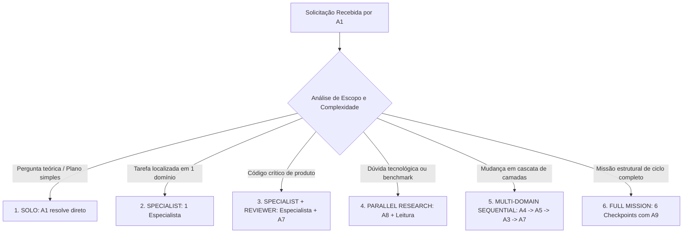

# MODOS DE ORQUESTRAÇÃO E FLUXOS DE EXECUÇÃO — APP REFLEX 02
### Os 6 Padrões Formais de Despacho de Subagentes pelo Arquiteto A1
**Missão:** AGENT HARNESS V2 | **Status:** Normativo e Canônico | **Data:** 2026-09-18

---

## 1. O Princípio da Não-Mobilização Cega

> [!CAUTION]
> **PROIBIÇÃO DE 'CHAMAR TODOS OS AGENTES':**  
> Despachar 9 agentes para uma tarefa de correção simples é um desperdício massivo de tokens, gera ruído de contexto e aumenta a probabilidade de regressão. O Arquiteto (A1) deve selecionar o **modo de orquestração mínimo viável** para a tarefa.

---

## 2. Os Seis Modos Canônicos de Orquestração

### 1. Modo SOLO
- **Quando usar:** Resposta a dúvidas conceituais, redação de ADRs, reorganização de índices ou elaboração de planos preliminares.
- **Participantes:** Apenas **A1**. Nenhum subagente é instanciado.

### 2. Modo SPECIALIST
- **Quando usar:** Ajuste pontual e não-crítico restrito a um domínio (ex: A2 ajustando uma cor de token, A6 corrigindo um arquivo de workflow de CI).
- **Participantes:** **A1** $\to$ **Especialista (A2, A3 ou A6)**.

### 3. Modo SPECIALIST + REVIEWER (Padrão de Produto)
- **Quando usar:** Qualquer implementação de nova funcionalidade, alteração de tela ou ajuste em regras de negócio.
- **Participantes:** **A1** $\to$ **Implementador (ex: A3)** $\to$ **Auditor (A7)**.
- **Fluxo:** O implementador produz o código e os testes locais; A7 executa a suíte independente e emite o laudo de release antes do merge.

### 4. Modo PARALLEL RESEARCH
- **Quando usar:** Diagnóstico de bugs complexos, prospecção de novos modelos de LLM ou avaliação de arquitetura de banco.
- **Participantes:** **A8** (pesquisa externa e benchmarks) em paralelo com **A4/A5** (inspeção forense do código interno em modo read-only).
- **Regra:** Proibida escrita simultânea no mesmo diretório.

### 5. Modo MULTI-DOMAIN SEQUENTIAL (Pipeline Cascata)
- **Quando usar:** Novas funcionalidades que atravessam banco, IA e tela (ex: implementar o Claim Card).
- **Sequência Estrita:**
  1. **A4:** Modela e aplica a migration no banco;
  2. **A5:** Cria o schema Zod e as funções de extração de claims;
  3. **A3:** Desenvolve o componente React e conecta à API;
  4. **A7:** Executa a bateria de testes integrados e de segurança;
  5. **A9:** Registra as evidências e emite o fechamento.

### 6. Modo FULL MISSION
- **Quando usar:** Missões maiores de ciclos inteiros acordadas com o ChatGPT (ex: MIS-0004, MIS-0005).
- **Protocolo de 6 Checkpoints Obrigatórios:**
  - **Checkpoint 0:** Validação de Baseline (HEAD de git e arquivos canônicos).
  - **Checkpoint 1:** Aprovação do Plano Arquitetural por A1.
  - **Checkpoint 2:** Execução isolada pelos especialistas owners.
  - **Checkpoint 3:** Verificação de testes dos especialistas.
  - **Checkpoint 4:** Auditoria independente e laudo de A7.
  - **Checkpoint 5:** Emissão do relatório de handoff AG-XXXX por A9 e push na main.

---

## 3. Gestão de Orçamentos (Budgets)

### Orçamento de Pesquisa para A8:
- **Limite de Questões:** Máximo de 3 sub-questões por tarefa.
- **Limite de Fontes:** Máximo de 5 fontes primárias confiáveis.
- **Critério de Parada:** Quando a evidência encontrada for conclusiva para fundamentar a decisão arquitetural.

### Orçamento de Chamadas de Ferramentas (Tool Budget):
- Não realizar buscas iterativas em lote (ex: 20 chamadas sequenciais de busca) quando uma leitura precisa do arquivo de especificação resolve a dúvida.
- Priorizar `grep_search` focado em vez de listar diretórios recursivos completos.
