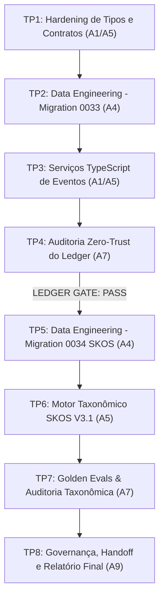

# TASK PACKETS — MISSÃO MIS-0009
## Wave 3: Gate de Integridade do Event Ledger + Taxonomia SKOS, Ontologia Formal e Ancoragem Conceitual
**Coordenador (Planner):** A1 (`rflex-architect`)  
**Data de Emissão:** 19 de setembro de 2026  
**Status do Gate:** `EXECUÇÃO AUTORIZADA PELO USUÁRIO`  
**Modo de Despacho:** `MULTI-DOMAIN SEQUENTIAL`

---

## 0. DECISÃO HUMANA DE SEGURANÇA: SECURITY-EXCEPTION-DEV-001

> **REGISTRO DE EXCEÇÃO DE SEGURANÇA E ADIAMENTO COMPULSÓRIO DE ROTAÇÃO**  
> - **ID:** `SECURITY-EXCEPTION-DEV-001`  
> - **Status:** `RISK ACCEPTED BY USER — DEVELOPMENT/TEST ONLY`  
> - **Justificativa Humana:** O usuário declarou expressamente que a credencial exposta pertence exclusivamente ao ambiente de criação/teste e optou por não executar sua rotação imediata para não paralisar o ciclo ágil de desenvolvimento.  
> - **Destino da Rotação:** `DEFERRED TO PRE-PRODUCTION SECURITY GATE`.  
> - **Production Security Gate Obrigatório:** Antes de qualquer migração para staging, publicação ou ambiente de produção, será compulsória a rotação completa de senhas e secrets, histórico Git higienizado e auditoria de vazamentos.  
> - **Regra Constitucional:** Não declarar falsamente "credencial rotacionada" ou "incidente resolvido". Nenhuma credencial aparecerá em Git, código, docs ou logs.

---

## 1. PACOTES DE TRABALHO SEQUENCIAIS

### TP1: Hardening de Tipos e Contratos do Event Ledger
- **Owner:** A1 (Arquitetura) com A5 (IA)
- **Escopo:**
  - `src/tipos/cognitivo-v3.ts`: schemas Zod fechados para todos os eventos da memória episódica (sem fail-open);
  - Adição de `occurred_at`, `from_epistemic_status`, `to_epistemic_status` e padronização para `payload_schema_version`;
  - Definição dos tipos SKOS (`SKOSConcept`, `SKOSRelation`, `ClaimConceptLink`).

### TP2: Data Engineering — Migration 0033 (Hardening do Event Ledger)
- **Owner:** A4 (Backend Supabase)
- **Escopo:**
  - Revogar `memory_events_insert_owner` (bloquear event forgery);
  - Adicionar colunas e constraints anti-cross-tenant `(id, usuario_id)`;
  - RPC humana `transicionar_estado_claim_humano` (fixa `actor_type = 'HUMAN'` e `actor_id = auth.uid()::text`);
  - RPC sistêmica `transicionar_estado_claim_sistema` (exclusiva de `service_role`, bloqueando confirmações autorais);
  - Validação estrita da máquina de estados no PostgreSQL.

### TP3: Serviços TypeScript do Event Ledger
- **Owner:** A1 / A5
- **Escopo:**
  - Atualização de `gerenciador-eventos.ts` com validação de payload estrita (sem fail-open);
  - Idempotência real determinística (sem timestamp volátil);
  - Validação completa de `(from, to, actor)` na máquina de estados.

### TP4: Auditoria Zero-Trust do Ledger Gate
- **Owner:** A7 (AppSec & QA)
- **Escopo:**
  - Testes adversariais de injeção de eventos, falsificação de ator, mutação/exclusão, cross-tenant e race conditions;
  - **GATE CONDICIONAL:** Emitir parecer formal `LEDGER GATE: PASS / FAIL`.

### TP5: Data Engineering — Migration 0034 (Taxonomia SKOS & Claim Concepts)
- **Owner:** A4 (Backend Supabase)
- **Escopo:**
  - Mapeamento e preservação das tabelas legadas de taxonomia;
  - Criação de `taxonomia.skos_conceitos`, `taxonomia.skos_relacoes` e `taxonomia.claim_conceitos` com RLS multi-tenant.

### TP6: Motor de Taxonomia SKOS V3.1
- **Owner:** A5 (IA & Conhecimento)
- **Escopo:**
  - Implementação de `src/dominios/taxonomia/motor-skos.ts`: normalização, anti-inflação, resolução de aliases e vinculação de claims;
  - Salvaguarda do Firewall: conceito em fonte externa não forja autoria.

### TP7: Golden Evals & Auditoria Taxonômica
- **Owner:** A7 com A5
- **Escopo:**
  - Casos executáveis em `golden-dataset-runner.test.ts` para a família `CBR-05-TAXONOMY`;
  - Medição de métricas: Concept Precision, Duplicate Rate, Spurious Rate, Alias Resolution;
  - Emissão do `TAXONOMY GATE: PASS`.

### TP8: Governança, CI e Handoff
- **Owner:** A9 (Continuidade)
- **Escopo:**
  - `docs/ia/WAVE_3_TAXONOMIA_SKOS_RESULT.md`;
  - `docs/coordenacao/antigravity-para-chatgpt/AG-0009.md`;
  - Atualização de `STATUS_PROJETO.md`, `ESTADO_COMPARTILHADO.md`, `INDICE_MISSOES.md` (corrigindo duplicidade do MIS-0010);
  - Verificação de CI verde e ativação da Stop Condition.
