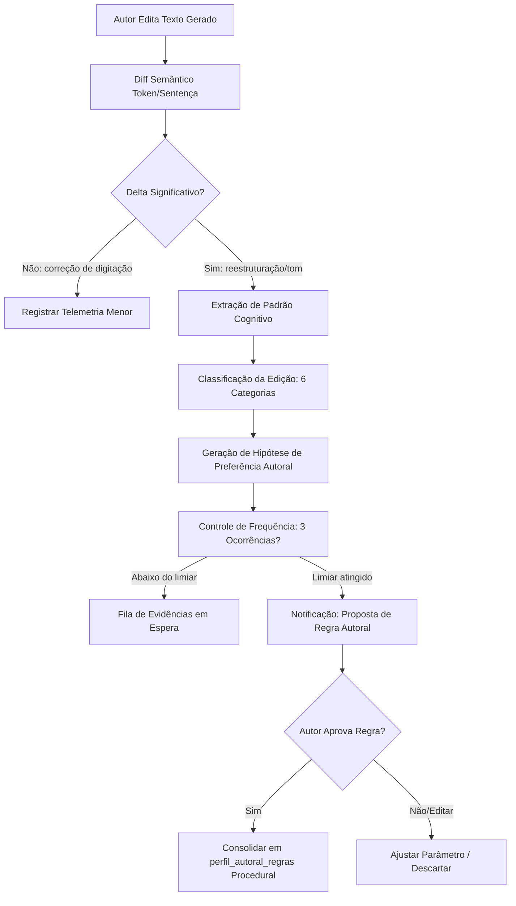

# ARQUITETURA DE APRENDIZADO POR EDIÇÃO — APP REFLEX 02 V3
**Missão:** MIS-0004 | **Status:** Arquitetura Normativa | **Data:** 2026-09-18

---

## 1. O Problema Fundamental da Edição em Sistemas Autorais

No App Reflex 02, o autor frequentemente corrige, reescreve, encurta ou refina saídas geradas por IA (sínteses de episódios, reflexões, propostas conceituais).
No App 01 anterior, a tabela `reflexao_edicoes` registrava o diff em texto bruto (`texto_antes`, `texto_depois`), mas:
1. Não extraía o **porquê** semântico da alteração.
2. Não transformava a edição em diretrizes procedurais reutilizáveis.
3. Não controlava o risco de **sobreajuste (overfitting)** estilístico (ex: transformar uma preferência situacional em regra dogmática global).

O Cérebro Autoral V3 introduz um subsistema de **Aprendizado por Edição com Human-in-the-Loop**, assegurando que toda edição seja analisada pedagogicamente, categorizada semanticamente e submetida a aprovação explícita antes de se tornar uma regra de estilo permanente.

---

## 2. Pipeline de Processamento de Edição



### Passo 1: Cálculo do Diff Estruturado
Em vez de diff de caracteres ingênuo (Levenshtein), o sistema calcula três métricas:
- **Jaccard Token Similarity:** Taxa de retenção lexical.
- **Delta de Extensão:** Variação percentual do tamanho (`len(depois) / len(antes)`).
- **Embeddings Cosine Similarity:** Mede se o sentido nuclear mudou ou se apenas a roupagem discursiva foi lapidada.

### Passo 2: Extração da Hipótese Semântica
Um LLM de consolidação (em background) compara `antes` e `depois` e gera um JSON estruturado:
```json
{
  "categoria": "ESTILO_DISCURSIVO",
  "operacao": "SUPRESSAO_METAFORA",
  "antes_fragmento": "uma teia complexa e multifacetada de sentimentos arquetípicos",
  "depois_fragmento": "relações emocionais contraditórias",
  "hipotese_intencao": "O autor prefere sobriedade clínica e rejeita jargão poético redundante em análises psicológicas.",
  "grau_certeza": 0.88
}
```

---

## 3. Taxonomia Canônica das 6 Categorias de Edição

| Categoria | Descrição | Exemplo de Gatilho | Destino da Memória |
|---|---|---|---|
| **1. Correção Factual** | Erro de dado, citação distorcida, data errada. | Mudança de ano ou referência de autor. | `memoria_episodica` (atualiza chunk) |
| **2. Estilo e Tom** | Nível de formalidade, vocabulário, adjetivação. | Troca de advérbios, corte de superlativos. | `perfil_autoral_regras` (estilo) |
| **3. Densidade e Concisão** | Supressão de redundâncias, corte de preâmbulos. | Remoção de parágrafos introdutórios burocráticos. | Diretriz de geração do agente autor |
| **4. Estrutura e Formatação** | Reordenação de tópicos, uso de bullet points. | Transformação de parágrafo contínuo em lista analítica. | Template procedural de reflexão |
| **5. Nuance Conceitual** | Afinação filosófica ou teórica de um conceito. | Diferenciação entre "vontade" e "desejo". | `conceitos_ontologia` (definição/escopo) |
| **6. Voz e Identidade** | Correção de postura (autor não fala na 3ª pessoa). | Eliminação de clichês motivacionais ou impessoais. | Prompt de sistema do Cérebro Autoral |

---

## 4. Prevenção de Sobreajuste (Anti-Overfitting Engine)

O maior perigo no aprendizado por feedback em IA criativa é a **generalização precipitada**:
*Exemplo:* O autor removeu a palavra "fundamental" em um texto específico; a IA assume que a palavra "fundamental" está terminantemente banida do vocabulário do autor para sempre.

Para impedir isso, o App Reflex 02 adota 4 salvaguardas matemáticas e operacionais:

1. **Limiar de Frequência e Diversidade de Contexto:**
   - Nenhuma hipótese é submetida a consolidação com menos de **3 evidências independentes** ocorridas em episódios distintos.
2. **Clusterização de Evidências:**
   - As evidências precisam convergir semanticamente (similaridade vetorial dos deltas $\ge 0.82$).
3. **Escopo Delimitado:**
   - Cada regra derivada de edição tem escopo definido: `GLOBAL` (raro), `POR_TIPO_DOCUMENTO` (ex: apenas em sínteses biográficas) ou `POR_TAXONOMIA` (apenas em tópicos de Psicanálise).
4. **Human-in-the-Loop Obrigatório:**
   - **Nenhuma regra entra em produção de forma autônoma e silenciosa.** O autor sempre vê:
     > *"Notamos que nas últimas 3 edições você removeu introduções de cortesia em sínteses técnicas. Deseja tornar isso uma regra padrão para o perfil técnico?" [Sim] [Não] [Editar]*

---

## 5. Esquema de Armazenamento no Supabase (Projeção V3)

```sql
CREATE TABLE IF NOT EXISTS aprendizagem_edicoes_v3 (
  id UUID PRIMARY KEY DEFAULT gen_random_uuid(),
  autor_id UUID NOT NULL,
  entidade_tipo VARCHAR(50) NOT NULL, -- 'episodio_sintese', 'reflexao', 'conceito'
  entidade_id UUID NOT NULL,
  texto_original TEXT NOT NULL,
  texto_editado TEXT NOT NULL,
  metricas_diff JSONB NOT NULL,       -- { jaccard, delta_chars, cosine_sim }
  categoria VARCHAR(50) NOT NULL,     -- 6 categorias canônicas
  hipotese_aprendizado TEXT NOT NULL,
  status_aprovacao VARCHAR(30) DEFAULT 'PENDENTE_CONFIRMACAO', -- 'EM_OBSERVACAO', 'PROPOSTA_AUTORAL', 'APROVADA', 'DESCARTADA'
  regra_gerada_id UUID REFERENCES perfil_autoral_regras(id),
  created_at TIMESTAMPTZ DEFAULT now()
);
```

---

## 6. Governança e Transparência (Metamemória)

O autor pode inspecionar a aba **"O que a IA aprendeu com você"**:
- Lista de todas as regras ativas derivadas de suas edições.
- Histórico de quais edições geraram cada regra (rastreabilidade total).
- Botão "Desativar regra" ou "Refinar escopo".

Esta abordagem garante total alinhamento ético e cognitivo, transformando o ato solitário de editar em um diálogo contínuo de afinação entre o autor e sua mente digital.
