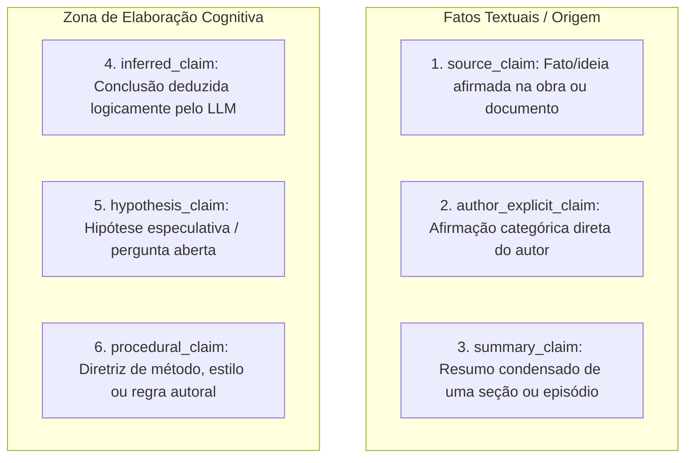
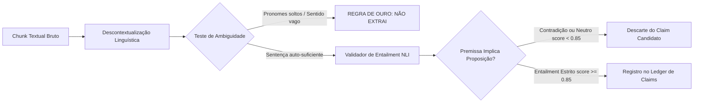

# ARQUITETURA DE CLAIMS E PROVENIÊNCIA — CÉREBRO REFLEX V3.1
### A Unidade Atômica de Significado, Protocolo de Extração e Lineage Ponta a Ponta
**Missão:** MIS-0005 | **Status:** Normativo e Conceitual | **Data:** 2026-09-18

---

## 1. O Conceito de Claim no App Reflex

Um **Claim** (Afirmação/Proposição) é a menor unidade discursiva verificável e contextualizada que expressa uma asserção sobre o mundo, sobre uma obra ou sobre o pensamento do autor.

> [!IMPORTANT]
> **Claim $\neq$ Verdade Absoluta.**  
> Um claim não é necessariamente um fato ontológico verdadeiro; ele é uma **asserção atribuível a um autor, documento ou momento**, dotada de valor de verdade passível de verificação contra sua fonte de origem.

A unidade tradicional de RAG (o *chunk* de 1.000 caracteres) é grande demais para checagem lógica fina e pequena demais para manter o contexto narrativo completo. O **Claim** resolve este dilema: o chunk serve de contêiner de contexto de leitura; o claim serve de unidade de raciocínio, verificação, linhagem e contradição.

---

## 2. Tipologia dos 6 Tipos de Claims



1. **`source_claim`:** Asserção contida em texto de terceiro ou documento externo registrado na biblioteca (ex: *"De acordo com Freud (1915), o recalque opera primariamente sobre representações"*).
2. **`author_explicit_claim`:** Afirmação verbal ou escrita direta do autor em primeira pessoa (ex: *"Eu decidi abandonar a metodologia X em favor da Y"*).
3. **`summary_claim`:** Síntese proposicional que encapsula um episódio sem introduzir fatos novos.
4. **`inferred_claim`:** Dedução lógica gerada por um modelo de IA conectando dois ou mais claims preexistentes.
5. **`hypothesis_claim`:** Conjectura plausível sugerida para reflexão, sem validação factual no acervo.
6. **`procedural_claim`:** Declaração de método, regra prática de escrita ou critério operacional.

---

## 3. Esquema Formal de Atributos do Claim

Cada claim gerado ou manipulado no sistema deve possuir a seguinte estrutura de dados:

```json
{
  "id": "claim_550e8400_e29b_41d4_a716_446655440000",
  "tipo": "author_explicit_claim",
  "epistemic_status": "extracted",
  "proposicao": "O processo criativo exige um período deliberado de distanciamento crítico antes da edição final.",
  "suporte_textual": {
    "source_id": "obra_99214_caderno_notas",
    "source_version": 2,
    "chunk_id": "chunk_3321_p4",
    "span_exato": "Preciso passar pelo menos 48 horas longe do manuscrito antes de começar os cortes.",
    "pagina_secao": "Seção 3 - Rituais de Revisão",
    "offset_inicio": 1420,
    "offset_fim": 1506
  },
  "contexto_situado": {
    "ator": "autor",
    "tempo_observado": "2024-05-14T15:30:00Z",
    "modalidade": "asserção_categórica",
    "escopo": "produção_literária",
    "idioma": "pt-BR"
  },
  "linhagem_extracao": {
    "extrator": "claim_extractor_v3_1",
    "modelo": "gpt-4o-mini",
    "prompt_version": "claim_ext_v1.4",
    "nli_entailment_score": 0.96,
    "is_decontextualized": true
  },
  "confidence_vector": {
    "support": 0.96,
    "provenance": 1.0,
    "independence": 0.90,
    "author_confirmation": 0.0,
    "temporal_fit": 0.85,
    "scope_fit": 0.95,
    "retrieval_stability": 0.88,
    "contradiction_load": 0.0,
    "model_agreement": 0.92,
    "historical_utility": 0.50
  }
}
```

---

## 4. Claim Validation: O Pipeline Anti-Alucinação

Inspirado nas pesquisas contemporâneas sobre descontextualização e entailment factual (como o framework *Claimify*), o pipeline de validação de claims do Reflex segue 3 fases rigorosas:



### 1. Descontextualização (Decontextualization)
O extrator reescreve a oração para que seu significado seja independente do texto circundante, substituindo anáforas e pronomes ("ele", "naquele dia", "a teoria citada anteriormente") pelos seus referentes explícitos ("Sigmund Freud", "14 de maio de 2024", "A teoria do recalque").

### 2. Tratamento de Ambiguidade — A Regra de Ouro:
> **SE HÁ AMBIGUIDADE NÃO RESOLVIDA $\longrightarrow$ NÃO EXTRAI.**  
> É preferível omitir a extração de um claim a registrar uma proposição incerta ou mal interpretada. O texto original continua disponível no chunk para leitura humana.

### 3. Verificação de Entailment (Natural Language Inference — NLI)
A proposição descontextualizada é confrontada contra o trecho exato da fonte (`span_exato`). Se o modelo de NLI classificar a relação como `neutral` ou `contradiction`, o claim é imediatamente descartado. Apenas classificações `entailment` com score robusto são aceitas.

---

## 5. Lineage Ponta a Ponta (Do Byte Original à Frase Final)

O Reflex V3.1 não admite "citações cosméticas" adicionadas após a geração do texto. Toda oração no texto gerado precisa ter seu **grafo de linhagem rastreável até a fonte primária**:

```
[DOCUMENTO / ÁUDIO NA BIBLIOTECA] (source_id: doc_01, sha256)
     │
     ▼
[CHUNK TEXTUAL CONTEXTUALIZADO] (chunk_id: chk_45, offsets 1024-1850)
     │
     ▼
[CLAIM ATÔMICO EXTRAÍDO E VALIDADO] (claim_id: clm_108, entailment=0.96)
     │
     ▼
[MEMÓRIA CONSOLIDADA / GRAFO] (rel: SUPPORTED_BY clm_108)
     │
     ▼
[RECUPERAÇÃO MULTI-ROTA] (retrieval_route: concept + temporal, score: 0.89)
     │
     ▼
[DOSSIÊ CONTEXTUAL V3.1] (slot: direct_evidence, allowed_use: CAN_SUPPORT)
     │
     ▼
[PLANO DE GERAÇÃO COGNITIVA] (tópico 2: "O método de distanciamento de 48h")
     │
     ▼
[FRASE FINAL GERADA] ("Como registrado em seu caderno de 2024, você estabeleceu o intervalo de 48 horas como requisito...")
     │
     ▼
[AUDITOR COGNITIVO] (Verificação de linhagem aprovada: 100% ancorada em clm_108)
```
