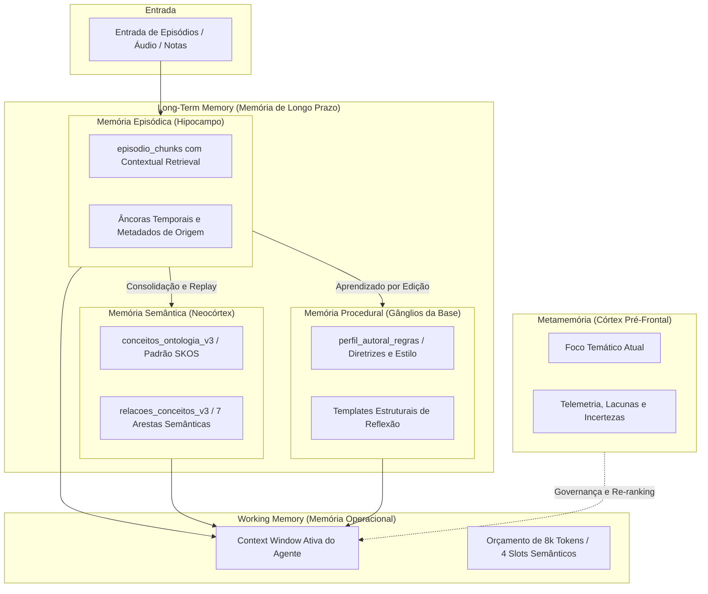

# ARQUITETURA COGNITIVA V3 — O CÉREBRO AUTORAL
### Sistema Integrado de Memória, Ontologia Relacional e Inteligência Aumentada
**Missão:** MIS-0004 | **Projeto:** App Reflex 02 | **Status:** Normativo e Canônico | **Data:** 2026-09-18

---

## 1. Sumário Executivo e Diagnóstico de Evolução

O **App Reflex 02** é uma plataforma de ampliação do pensamento, reflexão profunda e autoria intelectual. Seu propósito não é gerar texto genérico e impessoal, mas funcionar como uma extensão viva da mente do autor — preservando sua voz, contextualizando suas ideias ao longo do tempo, mapeando a evolução de seus conceitos e auxiliando na consolidação de novos insights.

### Diagnóstico do Sistema Anterior (App 01)
A auditoria cognitiva revelou limitações estruturais que impediam o salto qualitativo:
1. **Recuperação Vetorial Ingênua (Naive RAG):** Busca restrita à proximidade por cosseno em embeddings de fragmentos descontextualizados, gerando perda de contexto temporal e relacional.
2. **Equiparação de Vozes:** Textos originais do autor eram ponderados com o mesmo peso de citações de terceiros ou transições de áudio truncadas.
3. **Taxonomia Plana e Inflacionada:** Criação ad-hoc de tags textuais idênticas ou sinônimas sem estrutura ontológica ou controle hierárquico.
4. **Memória Amnésica em Edições:** As correções feitas pelo autor em reflexões geradas eram registradas em diffs brutos, mas sem extração pedagógica de regras ou preferências de estilo.
5. **Falta de Abstenção Honesta:** Diante de uma pergunta sobre assunto ausente do acervo, o sistema tentava alucinar com os chunks de maior proximidade vetorial matemática, ainda que irrelevantes.

### A Solução da Arquitetura V3
A Arquitetura V3 funda-se na **Neurociência Cognitiva da Memória Humana** e no **Estado da Arte de Sistemas de Memória de IA**, implementando um modelo de **PostgreSQL Cognitivo** de alta performance, sem dependência de bancos externos complexos ou frameworks proprietários frágeis.

---

## 2. Princípios Cognitivos e Arquiteturais Inegociáveis

1. **Contexto Insuficiente > Contexto Aleatório (Abstenção Honesta):**
   O sistema prefere declarar com clareza que não possui dados suficientes a produzir uma resposta baseada em fragmentos pouco relacionados.
2. **Proveniência Indivisível (Zero Alucinação de Citação):**
   Toda afirmação gerada deve carregar sua âncora de proveniência (`UUID` de chunk do episódio original). Citações fantasmas são terminantemente rejeitadas nos testes de qualidade.
3. **Assimetria Epistêmica Autoral:**
   A voz do autor possui precedência estrutural sobre materiais de terceiros. Fragmentos originais recebem multiplicador de relevância de $1.5\times$ no pipeline de ranking.
4. **Human-in-the-Loop em Aprendizado e Taxonomia:**
   A IA atua como assistente e proponente de hipóteses (de conceitos ou de regras de estilo); apenas a confirmação do autor efetiva a consolidação permanente.
5. **Soberania do PostgreSQL 17:**
   A infraestrutura é consolidada inteiramente no banco relacional Supabase com as extensões `pgvector` e `tsvector` lematizado em português, garantindo transações ACID, isolamento RLS, latência sub-100ms e previsibilidade de custos.

---

## 3. Modelo Integrado de Memória (Mapeamento Neurocientífico)

A V3 adota uma taxonomia tripartite de memória de longo prazo, integrada à memória operacional e à camada reflexiva de metamemória:

### Detalhamento dos Componentes:
- **Memória Episódica (`episodio_chunks`):** Registra eventos situados no tempo e espaço. Cada chunk recebe prefixo contextual gerado no momento da ingestão (quem disse, onde, em qual documento e data).
- **Memória Semântica (`conceitos_ontologia_v3`):** Conhecimento generalizado, destilado e atemporal, interligado em grafo hierárquico com o padrão SKOS (`broader`, `narrower`, `related`) e relações cognitivas (`desafia`, `exemplifica`, `precede`, `suporta`).
- **Memória Procedural (`perfil_autoral_regras`):** Regras ativas de redação, estilo, critérios de raciocínio e heurísticas de trabalho aprendidas via feedback e consolidadas com aprovação do autor.
- **Working Memory:** Gerenciador dinâmico de contexto que particiona o prompt dos agentes em 4 blocos rigorosamente orçados: (1) Diretrizes Procedurais, (2) Conceitos Semânticos Ativos, (3) Evidências Episódicas Recuperadas e (4) Conversa/Foco Imediato.
- **Metamemória:** Telemetria da inteligência, monitorando incertezas, contradições no acervo e áreas temáticas carentes de aprofundamento.

---

## 4. O Ciclo de Vida Cognitivo em 6 Etapas

### Etapa 1: Ingestão e Chunking Semântico Contextualizado
- Particionamento por coerência temático-estrutural (1.000 a 1.500 caracteres), respeitando parágrafos e pausas de raciocínio.
- **Contextual Retrieval:** Geração automática de resumo narrativo de 50 a 100 palavras adicionado como cabeçalho de embedding do chunk, eliminando a dependência do documento completo para compreensão semântica.

### Etapa 2: Indexação Híbrida e Vetorização
- Vetorização com modelo semântico `text-embedding-3-small` (1536 dimensões).
- Vetorização léxica com `tsvector` configurado para português brasileiro (lematização e remoção de stopwords).
- Índices HNSW para aproximação vetorial ultra-rápida combinados com índices GIN invertidos para correspondência exata.

### Etapa 3: Recuperação Multi-Sinal e Re-Ranking
A recuperação não usa apenas cosseno. Ela avalia uma função composta ponderada:
$$S = 0.40 \cdot S_{vetorial} + 0.25 \cdot S_{lexico} + 0.15 \cdot W_{autoral} + 0.10 \cdot S_{ontologia} + 0.10 \cdot D_{temporal}$$
Onde $W_{autoral} = 1.5$ se o fragmento for de autoria direta do usuário, priorizando seu pensamento autêntico sobre materiais externos.

### Etapa 4: Classificação de Intenção e Abstenção
O sistema analisa a pergunta em 6 perfis de intenção:
1. `SINTESE_RECUPERACAO`: Foco factual e histórico em notas passadas.
2. `EXPLORACAO_CONCEITUAL`: Mapeamento de relações e evolução de conceitos.
3. `DESAFIO_CONTRADICAO`: Busca ativa por tensões e mudanças de opinião.
4. `PRODUCAO_AUTORAL`: Geração de ensaio ou artigo respeitando o estilo pessoal.
5. `ORGANIZACAO_TAXONOMICA`: Categorização e criação de nós ontológicos.
6. `METAMEMORIA_AUDITORIA`: Avaliação do acervo e identificação de lacunas.

**Barreira de Abstenção:** Se o melhor chunk obtiver score normalizado inferior a $\tau = 0.55$, o sistema emite abstenção explícita com alternativas de pesquisa.

### Etapa 5: Consolidação Assíncrona e Replay Noturno
Inspirado na teoria dos Sistemas de Aprendizado Complementar (CLS):
- Episódios recém-criados permanecem no buffer episódico de alta fidelidade.
- A cada ciclo assíncrono (ou noturno), o motor de replay reavalia grupos de episódios, detecta conceitos emergentes, identifica contradições conceituais temporais e atualiza resumos neocorticais.

### Etapa 6: Aprendizado por Edição com Human-in-the-Loop
- O autor edita uma resposta ou síntese.
- O sistema calcula o diff semântico e categoriza a alteração em uma das 6 classes canônicas: *Factual, Estilo/Tom, Concisão, Estrutura, Nuance Conceitual* ou *Voz/Identidade*.
- A regra só é proposta ao autor após acumular **3 ocorrências convergentes** em contextos distintos, eliminando riscos de overfitting.

---

## 5. Arquitetura de Dados: Estrutura PostgreSQL 17 / Supabase

A inteligência V3 apoia-se em 6 tabelas nucleares e 2 funções analíticas no Supabase:

| Tabela / Função | Papel no Sistema Cognitivo | Tipo de Acesso |
|---|---|---|
| `episodio_chunks` | Memória episódica com embedding HNSW + `tsvector_pt` | Leitura intensiva (RRF) |
| `conceitos_ontologia_v3` | Nós conceituais semânticos (SKOS: prefLabel, definition) | Leitura / Escrita assistida |
| `relacoes_conceitos_v3` | Arestas do grafo (broader, narrower, related, desafia) | Consultas recursivas (`WITH RECURSIVE`) |
| `perfil_autoral_regras` | Memória procedural (regras de tom, estrutura e estilo) | Injetada na Working Memory |
| `aprendizagem_edicoes_v3` | Fila de hipóteses e histórico de deltas semânticos | Escrita no save / Processamento assíncrono |
| `fila_consolidacao_v3` | Fila de reconciliação de longo prazo e detecção de contradições | Background worker |
| `busca_cognitiva_hibrida(...)` | Stored Procedure que calcula o score RRF + ponderação autoral | Execução no banco em <50ms |
| `expandir_grafo_conceitual(...)` | Stored Procedure que navega até 2 graus de distância sem recursão infinita | Execução no banco em <15ms |

---

## 6. Integração com os 9 Agentes do App Reflex 02

A V3 oferece suporte cognitivo específico para cada agente da equipe:

- **A1 — Maestro Geral:** Consulta a metamemória para saber o estado do conhecimento antes de delegar tarefas.
- **A2 — Arquiteto e Guardião de Dados:** Garante que toda query respeite o isolamento RLS e as barreiras de integridade referencial.
- **A3 — Ingestão, Extração e Transcrição:** Aplica o Contextual Retrieval e a sanitização semântica na entrada de áudio e texto.
- **A4 — Inteligência Autoral, Taxonomia e RAG:** Opera como regente direto da recuperação multi-sinal e expansão ontológica.
- **A5 — UI/UX e Design System:** Renderiza o grafo conceitual, o painel de metamemória e os drawers de citações auditáveis.
- **A6 — Qualidade, Testes e Evals:** Roda o runner de Evals V2 contra o Golden Dataset a cada alteração.
- **A7 — Observabilidade e Custos:** Monitora latências P95, consumo de tokens por síntese e qualidade dos embeddings.
- **A8 — Pesquisa Aplicada e Inovação:** Monitora benchmarks de novos modelos de embedding e avanços científicos em RAG e grafos.
- **A9 — Coordenação e Continuidade:** Registra a evolução da arquitetura nos protocolos canônicos e valida o handoff entre o usuário, ChatGPT e Antigravity.

---

## 7. Referências Cruzadas de Documentos da MIS-0004

A especificação detalhada de cada módulo encontra-se nos seguintes documentos canônicos do repositório:
- [PESQUISA_NEUROCIENCIA_MEMORIA.md](file:///e:/APP/Reflex%2002/reflex02/docs/ia/PESQUISA_NEUROCIENCIA_MEMORIA.md)
- [PESQUISA_MEMORIA_ARTIFICIAL_ESTADO_ARTE.md](file:///e:/APP/Reflex%2002/reflex02/docs/ia/PESQUISA_MEMORIA_ARTIFICIAL_ESTADO_ARTE.md)
- [COMPARATIVO_RAG_GRAPH_MEMORY.md](file:///e:/APP/Reflex%2002/reflex02/docs/ia/COMPARATIVO_RAG_GRAPH_MEMORY.md)
- [MODELO_MEMORIA_EPISODICA_SEMANTICA_PROCEDURAL.md](file:///e:/APP/Reflex%2002/reflex02/docs/ia/MODELO_MEMORIA_EPISODICA_SEMANTICA_PROCEDURAL.md)
- [ARQUITETURA_TAXONOMIA_GRAFO_V3.md](file:///e:/APP/Reflex%2002/reflex02/docs/ia/ARQUITETURA_TAXONOMIA_GRAFO_V3.md)
- [ARQUITETURA_RETRIEVAL_V3.md](file:///e:/APP/Reflex%2002/reflex02/docs/ia/ARQUITETURA_RETRIEVAL_V3.md)
- [ARQUITETURA_CONSOLIDACAO_REPLAY.md](file:///e:/APP/Reflex%2002/reflex02/docs/ia/ARQUITETURA_CONSOLIDACAO_REPLAY.md)
- [ARQUITETURA_APRENDIZADO_POR_EDICAO.md](file:///e:/APP/Reflex%2002/reflex02/docs/ia/ARQUITETURA_APRENDIZADO_POR_EDICAO.md)
- [PLANO_EVALS_V2.md](file:///e:/APP/Reflex%2002/reflex02/docs/ia/PLANO_EVALS_V2.md)
- [ROADMAP_IMPLEMENTACAO_V3.md](file:///e:/APP/Reflex%2002/reflex02/docs/ia/ROADMAP_IMPLEMENTACAO_V3.md)
- [0002-arquitetura-cognitiva-v3.md](file:///e:/APP/Reflex%2002/reflex02/docs/adr/0002-arquitetura-cognitiva-v3.md)
