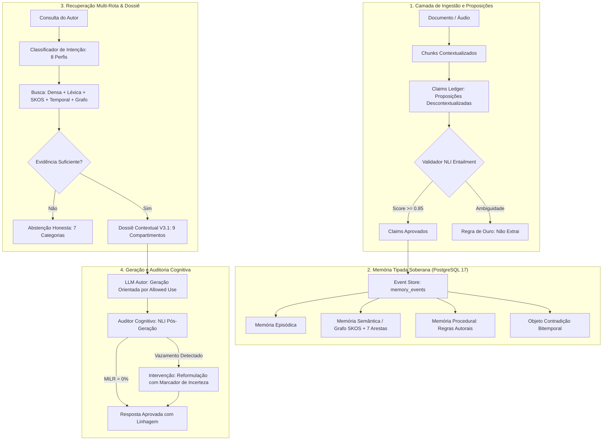

# ARQUITETURA COGNITIVA V3.1 — O CÉREBRO REFLEX
### Especificação Unificada de Memória Tipada, Claims, Firewall Epistêmico e Governança
**Missão:** MIS-0005 | **Projeto:** App Reflex 02 | **Status:** Normativo e Canônico | **Data:** 2026-09-18

---

## 1. Sumário Executivo e Origem da Versão 3.1

O **Cérebro Reflex V3.1** consolida a fusão estratégica entre:
1. Os fundamentos neurocientíficos e de banco relacional soberano (PostgreSQL 17) desenvolvidos na **MIS-0004**;
2. A pesquisa aprofundada de engenharia de conhecimento e epistemologia de dados fornecida pelo usuário (**"Arquitetura Cognitiva V3 do App Reflex"**);
3. O estado real do código-fonte auditado no repositório;
4. A literatura científica contemporânea de ponta (**Claimify, LongMemEval, LoCoMo, BEAM, HippoRAG 2, SKOS W3C**).

### A Mudança de Paradigma Central
Na versão V3 preliminar, o sistema organizava a recuperação em torno de fragmentos (*chunks*) e pontuações fixas de similaridade.
Na versão **V3.1**, a arquitetura eleva a integridade epistêmica ao nível máximo:
- O **Claim (Proposição Verificável)** torna-se a unidade atômica de raciocínio, linhagem e validação;
- Toda informação possui um de **10 Estados Epistemológicos** explícitos;
- O **Memory-Inference Firewall** impede que o modelo confunda deduções momentâneas com memórias confirmadas pelo autor;
- A certeza deixa de ser um número arbitrário e passa a ser um **Vetor de Confiança de 10 Componentes**;
- A abstenção ganha taxonomia própria em 7 modalidades de resposta honesta.

---

## 2. Reclassificação de Parâmetros: De "Fatos Universais" a "Baseline Experimental"

Em conformidade com a auditoria crítica da V3, todos os valores escalares anteriormente propostos são formalmente reclassificados como **`BASELINE EXPERIMENTAL`** (hipóteses de trabalho que deverão ser empiricamente calibradas através do Framework de Evals e dos benchmarks A/B):

| Parâmetro Anterior | Classificação V3.1 | Justificativa Epistêmica | Processo de Calibração |
|---|:---:|---|---|
| **Multiplicador 1.5× Autoral** | `BASELINE EXPERIMENTAL` | O peso relativo da voz autoral varia conforme a intenção da tarefa. | Calibração via Grid Search no Golden Dataset (`CBR-AUTHOR`). |
| **Limiar de Abstenção $\tau = 0.55$** | `BASELINE EXPERIMENTAL` | Limiares fixos geram falso-positivos em perguntas conceituais abertas. | Curva ROC / Precision-Recall no benchmark `CBR-ABSTENTION`. |
| **3 Ocorrências para Aprendizado** | `BASELINE EXPERIMENTAL` | 3 repetições é uma heurística inicial; pode gerar sobreajuste em temas pontuais. | Avaliação longitudinal de drift estilístico (`CBR-LEARNING`). |
| **Orçamento de 8k Tokens / 4 Slots** | `BASELINE EXPERIMENTAL` | A capacidade ideal da Working Memory varia de acordo com o modelo de LLM. | Testes comparativos de orçamento (2k, 4k, 8k, 16k tokens). |
| **Janela de 1.000–1.500 Chars** | `BASELINE EXPERIMENTAL` | Quebras de parágrafo naturais devem ditar o tamanho sem truncamento rígido. | Medição de preservação de sentido (Decontextualization Error Rate). |
| **Pesos Fixos da Função RRF** | `BASELINE EXPERIMENTAL` | A ponderação entre denso e léxico depende do vocabulário da área. | Ajuste dinâmico guiado pelo perfil de intenção da busca. |
| **P95 $\le 300\text{ ms}$ e Custos** | `BASELINE EXPERIMENTAL` | Metas aspiracionais de engenharia sujeitas à latência de rede e APIs. | Telemetria contínua via Agente A6 e A7. |

---

## 3. Governança Canônica dos 9 Agentes (Alinhamento Constitucional)

Para evitar desvios de responsabilidade identificados em documentações anteriores, a governança do App Reflex 02 reafirma as atribuições exclusivas e inegociáveis de cada agente da equipe:

```
┌────────────────────────────────────────────────────────────────────────┐
│                   A1 — ARQUITETURA E COORDENAÇÃO                       │
│  Guardião da integridade estrutural, contratos de domínio e regência   │
└──────────────────┬──────────────────────────────────┬──────────────────┘
                   │                                  │
         ┌─────────┴─────────┐              ┌─────────┴─────────┐
         ▼                   ▼              ▼                   ▼
    A2 — DESIGN         A3 — FRONTEND   A4 — BACKEND         A5 — IA E
      E UX               (Next/React)    E SUPABASE        CONHECIMENTO
  (Interfaces e        (Componentes,    (PostgreSQL,       (RAG, Claims,
   Acessibilidade)      Navegação e      RLS, Storage,     Firewall, NLI,
                        Responsividade)  Integridade)      Taxonomia SKOS)
         │                   │              │                   │
         └─────────┬─────────┘              └─────────┬─────────┘
                   │                                  │
         ┌─────────┴─────────┐              ┌─────────┴─────────┐
         ▼                   ▼              ▼                   ▼
    A6 — PLATAFORMA     A7 — QUALIDADE  A8 — PESQUISA        A9 — CONTINUIDADE,
        E SRE           E SEGURANÇA     E EVOLUÇÃO           EVIDÊNCIA E COMUNICAÇÃO
     (CI/CD, Git,        (Evals V3,      (Diagnóstico,        (Livro-razão de fatos,
      Infra e Logs)      AppSec, RLS     Literatura de ponta, protocolos, handoffs
                         e Auditoria)    novos paradigmas)    Usuário ↔ ChatGPT ↔ AGY)
```

Nenhum documento de IA tem autoridade para redefinir ownership de infraestrutura, banco de dados ou governança de agentes.

---

## 4. Classificação Formal da Pesquisa Externa (Literatura de Referência)

Para assegurar rigor acadêmico e transparência metodológica, os paradigmas de pesquisa externa foram rigorosamente analisados e classificados:

| Referência / Modelo | Classificação | Contribuição Adotada no Reflex V3.1 | Limitação / Elemento Rejeitado |
|---|:---:|---|---|
| **Claimify** | `PEER-REVIEWED` | Protocolo de descontextualização de sentenças e validação por NLI Entailment. | Não adotamos seu pipeline pesado de multi-agentes autônomos para parsing simples. |
| **SKOS (W3C Standard)** | `OFFICIAL DOC` | Padrão semântico formal para taxonomia (`prefLabel`, `broader`, `narrower`, `related`). | Não forçamos relações dialéticas e temporais dentro da ontologia SKOS. |
| **Contextual Retrieval (Anthropic)** | `COMPANY BENCHMARK` | Prefixação narrativa de 50-100 palavras por chunk antes de gerar o embedding. | Adaptamos para o português e integramos ao ledger de claims. |
| **HippoRAG 2** | `PREPRINT` | Princípio de navegação associativa por grafo de entidades inspirado no hipocampo. | Rejeitamos dependência de bancos externos; usamos CTEs recursivas no Postgres. |
| **LongMemEval / LongMemEval-V2** | `PREPRINT` | Metodologia de avaliação de memória temporal e resistência a contradições. | Usamos seus princípios no Golden Dataset sem adotar seus dados em inglês. |
| **LoCoMo / BEAM** | `PREPRINT` | Frameworks de avaliação de coerência e esquecimento sob orçamentos restritos. | Adaptados para as 12 famílias CBR do Reflex. |
| **Graphiti** | `OSS` | Conceito de grafos temporais bitemporais com invalidação de arestas. | **Rejeitada a instalação da biblioteca**; implementado nativamente via colunas temporais SQL. |
| **MemGPT / Letta / Mem0** | `OSS / PRODUCT` | Conceito de separação de níveis de memória (Core vs Archival). | **Rejeitada a dependência de SaaS externo** ou frameworks que retiram soberania dos dados. |
| **Microsoft GraphRAG** | `COMPANY BENCHMARK` | Resumos comunitários hierárquicos e clusters de conhecimento. | **Rejeitado devido ao custo proibitivo** de indexação global (\$10 a \$30 por obra). |

---

## 5. Arquitetura Lógica Unificada: Do Dado ao Insight



---

## 6. Síntese dos Entregáveis Normativos da MIS-0005

Para consulta aprofundada de cada pilar da Arquitetura V3.1, consulte os cadernos dedicados:
- [MODELO_EPISTEMOLOGICO_V3_1.md](file:///e:/APP/Reflex%2002/reflex02/docs/ia/MODELO_EPISTEMOLOGICO_V3_1.md)
- [ARQUITETURA_CLAIMS_PROVENANCE.md](file:///e:/APP/Reflex%2002/reflex02/docs/ia/ARQUITETURA_CLAIMS_PROVENANCE.md)
- [POLITICA_MEMORY_INFERENCE_FIREWALL.md](file:///e:/APP/Reflex%2002/reflex02/docs/ia/POLITICA_MEMORY_INFERENCE_FIREWALL.md)
- [GRAFO_EPISTEMOLOGICO_TEMPORAL.md](file:///e:/APP/Reflex%2002/reflex02/docs/ia/GRAFO_EPISTEMOLOGICO_TEMPORAL.md)
- [MODELO_CONFIDENCE_VECTOR.md](file:///e:/APP/Reflex%2002/reflex02/docs/ia/MODELO_CONFIDENCE_VECTOR.md)
- [DOSSIE_CONTEXTUAL_V3_1.md](file:///e:/APP/Reflex%2002/reflex02/docs/ia/DOSSIE_CONTEXTUAL_V3_1.md)
- [AUDITOR_COGNITIVO_V3_1.md](file:///e:/APP/Reflex%2002/reflex02/docs/ia/AUDITOR_COGNITIVO_V3_1.md)
- [GOLDEN_DATASET_V3_SPEC.md](file:///e:/APP/Reflex%2002/reflex02/docs/ia/GOLDEN_DATASET_V3_SPEC.md)
- [BENCHMARK_RETRIEVAL_V3_SPEC.md](file:///e:/APP/Reflex%2002/reflex02/docs/ia/BENCHMARK_RETRIEVAL_V3_SPEC.md)
- [ROADMAP_V3_1.md](file:///e:/APP/Reflex%2002/reflex02/docs/ia/ROADMAP_V3_1.md)
- [0003-modelo-epistemologico-v3-1.md](file:///e:/APP/Reflex%2002/reflex02/docs/adr/0003-modelo-epistemologico-v3-1.md)
