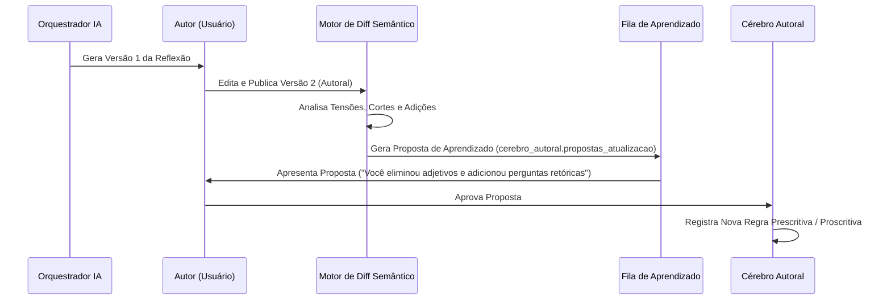

# Auditoria do Cérebro Autoral e Loop de Aprendizado — App Reflex 02

**Data:** 18 de setembro de 2026  
**Líder:** A5 (rflex-ai-knowledge) & A1 (rflex-architect)  
**Auditor Independente:** A7 (rflex-qa-security)  

---

## 1. Auditoria do Módulo `analisador-dimensoes.ts`

### Constatação Crítica Confirmada
Na inspeção de `src/dominios/cerebro/analisador-dimensoes.ts`, identificou-se uma grave violação dos princípios de autoria e integridade do App Reflex 02:

```typescript
// Linhas 117-121 de analisador-dimensoes.ts:
origem: "nucleo_autoral",
confianca_calculada: 0.92, // <--- VALOR HARDCODED SEM CÁLCULO REAL
total_evidencias: carac.evidencias.length,
total_contraevidencias: 0,
total_obras_distintas: 1,
estado_revisao: "confirmada", // <--- GRAVAÇÃO COMO VERDADE CONFIRMADA SEM AVAL DO AUTOR
```

### Impacto no Sistema
1. **Falsa Confiança Epistêmica:** O sistema atribuía um índice arbitrário de 92% de certeza para qualquer saída gerada pelo modelo `gpt-4o`, independentemente da qualidade ou escassez das evidências.
2. **Confirmação Não Autorizada:** A IA promovia diretamente suas inferências para o status de `"confirmada"`, violando a Regra de Ouro nº 4 do App Reflex 02 (*RASCUNHO IA ≠ AUTORIA CONFIRMADA*).
3. **Impossibilidade de Distinguir Fato de Alucinação:** O autor não conseguia diferenciar no painel o que era uma regra metodológica realmente sua do que era uma dedução não verificada do modelo.

---

## 2. Nova Fórmula Explicável de Confiança Autoral (Para V2)

Para a Arquitetura Cognitiva V2, a confiança deixa de ser uma constante arbitrária e passa a ser calculada por uma função matemática determinística e auditável:

$$\text{Confiança} = w_e \cdot E + w_o \cdot O + w_t \cdot T + w_h \cdot H - w_c \cdot C$$

Onde:
- $E$ (Evidências): Densidade e força das citações literais textuais ($w_e = 0.35$).
- $O$ (Diversidade de Obras): Quantidade de livros/artigos distintos onde o padrão se repete ($w_o = 0.25$).
- $T$ (Estabilidade Temporal): Intervalo temporal entre as obras que atestam a permanência do método ($w_t = 0.15$).
- $H$ (Confirmação Humana): Validação explícita pelo autor ($w_h = 0.25$; valor zero até que o autor confirme).
- $C$ (Contraevidências): Penalidade aplicada quando o autor viola deliberadamente a suposta regra em outras passagens ($w_c = 0.40$).

### Estados Canônicos de Revisão do Cérebro
Toda característica ou regra extraída por IA deve nascer obrigatoriamente como:
```
proposta ➔ em_validacao ➔ confirmada (somente por ação humana) ➔ rejeitada
```
A IA **nunca** possui permissão para definir o estado como `confirmada`.

---

## 3. Loop de Aprendizado por Edição Autoral

O verdadeiro aprendizado do App Reflex 02 não reside em "fine-tuning" de pesos de redes neurais, mas em uma esteira de captura de feedback de alto nível:



Este fluxo garante que a IA aprenda **como o autor pensa e prefere se expressar**, preservando a integridade da autoria humana.
