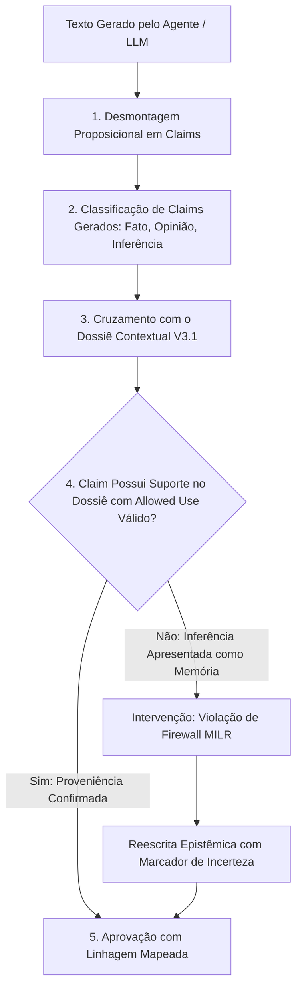

# AUDITOR COGNITIVO V3.1 — VERIFICAÇÃO PÓS-GERAÇÃO
### O Guardião Epistêmico de Saída, Desmontagem de Claims e Cálculo de MILR
**Missão:** MIS-0005 | **Status:** Normativo e Conceitual | **Data:** 2026-09-18

---

## 1. O Papel do Auditor Cognitivo

O **Auditor Cognitivo V3.1** opera como a última e mais rigorosa linha de defesa do sistema.
Ele atua após a geração da resposta pelo LLM e antes da exibição ao usuário na interface ou persistência no banco de dados.

> [!IMPORTANT]
> **PRINCÍPIO DE INTERVENÇÃO:**  
> Se o modelo de linguagem alucinar uma memória pessoal ou afirmar algo sobre o autor sem respaldo formal no Dossiê Contextual, o Auditor Cognitivo **intercepta o texto, bloqueia a exibição direta e força a reformulação epistemológica.**

---

## 2. Pipeline de Auditoria em 5 Etapas



### Etapa 1: Desmontagem Proposicional (Claim Extraction)
O texto gerado é fatiado em suas orações constituintes, extraindo as asserções atômicas declaradas.

### Etapa 2: Classificação de Intenção do Claim Gerado
Cada frase é categorizada semanticamente:
- Afirmação sobre o autor (*"Você acredita que a solidão é fértil"*);
- Afirmação sobre obra externa (*"Nietzsche publicou Assim Falou Zaratustra em..."*);
- Afirmação metodológica (*"Para este ensaio, utilizaremos três seções"*);
- Especulação reflexiva (*"Talvez essa dúvida aponte para um conflito entre..."*).

### Etapa 3: Verificação de Linhagem contra o Dossiê
O Auditor verifica se o claim gerado possui uma aresta `SUPPORTED_BY` apontando para um item válido presente no Dossiê Contextual.

### Etapa 4: Checagem de Allowed Use
Se a frase gerada for assertiva sobre o autor, o item correspondente no Dossiê **deve** possuir a tag `CAN_SUPPORT_AUTHORIAL_CLAIM` e status `confirmed_authorial` ou `extracted`.
- Se o item tiver status `inferred` ou `hypothesized`, há uma violação do **Memory-Inference Firewall**.

### Etapa 5: Ação Corretiva e Telemetria
- **Caso Aprovado:** O texto é liberado para a interface com os links de proveniência atrelados aos spans.
- **Caso Violado:** O Auditor substitui a afirmativa indevida pela versão epistemicamente atenuada (ex: transforma *"Você rejeita X"* em *"Em algumas anotações você manifestou desconforto com X; esta rejeição permanece válida?"*) e registra um evento de vazamento no log de telemetria.

---

## 3. A Métrica MILR em Tempo de Execução

O Auditor Cognitivo mantém o registro acumulado do **Memory-Inference Leakage Rate**:

```typescript
interface AuditoriaResultado {
  textoAprovado: string;
  totalClaimsGerados: number;
  claimsComSuporteFactual: number;
  claimsInferidosLegitimos: number; // Apresentados honestamente como inferência
  vazamentosDetectados: number;     // Inferências mascaradas de memórias
  milrDaExecucao: number;          // vazamentos / totalClaimsMemoria
  intervencoesRealizadas: {
    fraseOriginal: string;
    fraseCorrigida: string;
    motivo: string;
  }[];
}
```

Qualquer execução em que o `milrDaExecucao > 0` gera um alerta de observabilidade para o Agente A7 (Qualidade e Segurança) e A9 (Continuidade).
