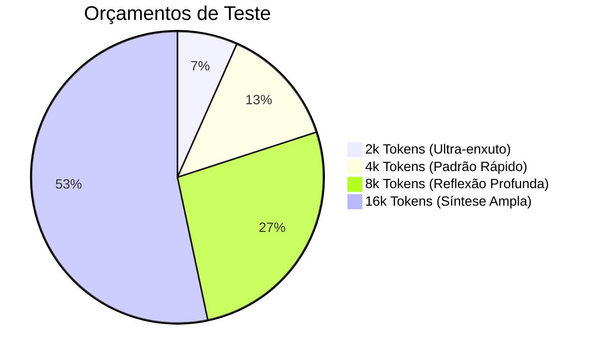
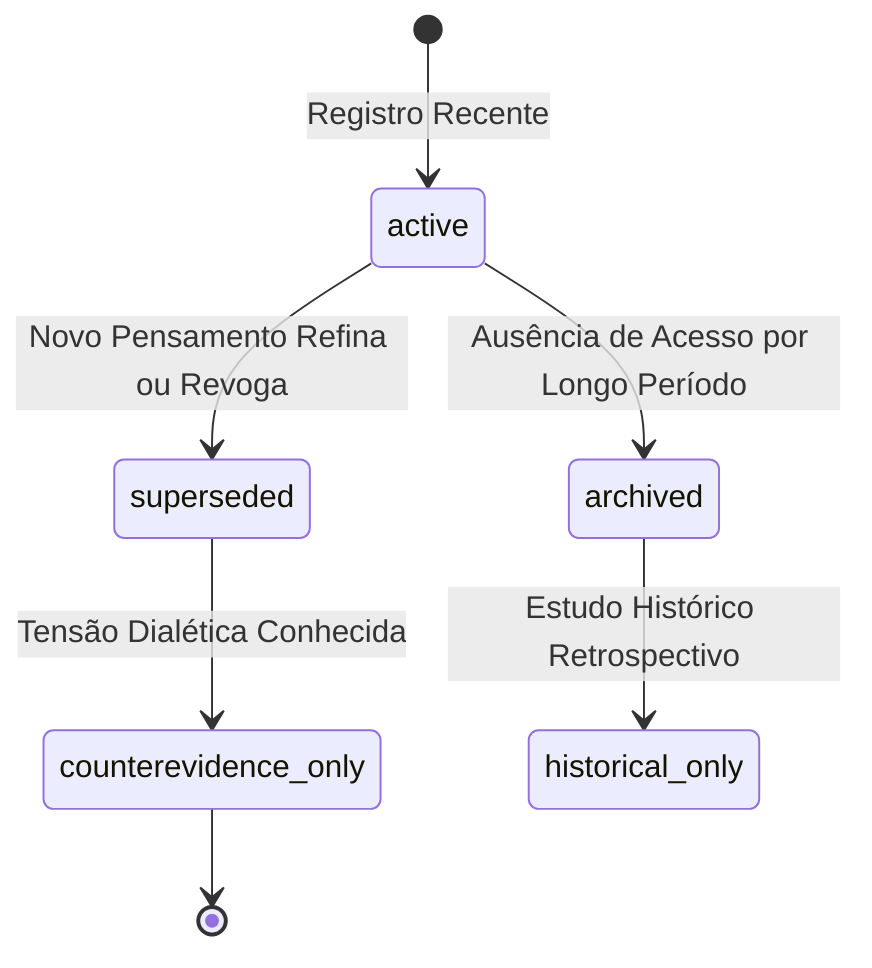

# ESPECIFICAÇÃO DO BENCHMARK A/B DE RETRIEVAL — CÉREBRO REFLEX V3.1
### Protocolo Comparativo de Rotas, Avaliação por Orçamento Rígido e Deprioritization
**Missão:** MIS-0005 | **Status:** Normativo e Especificação de Teste | **Data:** 2026-09-18

---

## 1. O Princípio de Avaliação sob Orçamento Fixo

> [!IMPORTANT]
> **REGRA DE BENCHMARK:**  
> **Não premiar uma arquitetura de recuperação apenas porque ela inundou a janela do LLM com mais contexto.**  
> Qualquer modelo atinge maior recall se enviar 30 chunks (15.000 tokens), mas degrada a precisão de raciocínio, eleva o custo e aumenta alucinações. O benchmark avalia a densidade informativa e a relevância **sob orçamentos de contexto idênticos e restritos**.

---

## 2. A Matriz de Comparação A/B/C/D/E/F de Rotas

O framework de testes submete exatamente o mesmo conjunto de consultas e acervo às seguintes 6 configurações incrementais de recuperação:

```
Rota A: Dense Vetorial Isolado (Baseline Naive RAG)
   ↓
Rota B: Dense Vetorial + Léxico BM25 / tsvector (Busca Híbrida Padrão)
   ↓
Rota C: Dense + Léxico + Ancoragem Taxonômica SKOS
   ↓
Rota D: Rota C + Filtros e Decaimento Temporal Bitemporal
   ↓
Rota E: Rota D + Expansão Relacional no Grafo Epistemológico (2 graus)
   ↓
Rota F: Rota E + Cross-Encoder Reranker de Precisão
```

### Protocolo de Execução do Experimento:

| Configuração | Componentes Ativos | Hipótese Testada | Métrica Crítica |
|---|---|---|---|
| **Rota A** | `pgvector` HNSW (`text-embedding-3-small`) | Linha de base da recuperação tradicional. | Recall@5, Cosine Drift |
| **Rota B** | HNSW + `tsvector_pt` lematizado + RRF | O casamento lexical resgata termos raros e nomes próprios. | MRR, Lexical Recovery |
| **Rota C** | HNSW + `tsvector` + Expansão de Sinônimos SKOS | A taxonomia formal desambigua conceitos afins. | Precision@5 |
| **Rota D** | Rota C + Ponderação Bitemporal | Previne trazer notas antigas como se fossem atuais. | Temporal Precision |
| **Rota E** | Rota D + CTEs Recursivas SQL (`WITH RECURSIVE`) | Conecta claims relacionados que não compartilham termos. | Multi-hop Recall |
| **Rota F** | Rota E + Re-ranking de Cross-Encoder | Elimina falsos positivos antes da injeção no Dossiê. | Context Purity ($\ge 85\%$) |

---

## 3. Avaliação por Orçamentos Estritos de Contexto (Context Budgets)

O teste é repetido sob 4 limites orçamentários fixos:



### Métricas Padronizadas Calculadas em Cada Cenário:
- **Recall@K:** Fração de claims essenciais recuperados dentro do orçamento $K$.
- **Precision@K:** Fração de tokens injetados que foram efetivamente aproveitados na resposta.
- **Tokens/Evidência:** Custo em tokens para cada afirmação factual suportada com sucesso.
- **Latência Fim a Fim (P50, P90, P99):** Tempo em milissegundos da consulta até a montagem do Dossiê.

---

## 4. Política de Esquecimento e Despriorização (Sem Destruição de Histórico)

O Reflex V3.1 rejeita o apagamento cego de dados (`DELETE`). O "esquecimento" computacional opera por **deprioritization de recuperação**:



### Estados de Prioridade de Recuperação (`retrieval_priority`):
1. **`active`:** Memória prioritária para uso em reflexões imediatas e cotidianas.
2. **`archived`:** Memória dormente, recuperada apenas se a busca mencionar termos específicos.
3. **`superseded`:** Memória desativada para respostas sobre o presente, mas preservada para linhas do tempo.
4. **`counterevidence_only`:** Memória reservada exclusivamente para o compartimento de contraevidências quando o autor estiver debatendo uma ideia.
5. **`historical_only`:** Registro acessível apenas em consultas do tipo: *"O que eu pensava sobre isso em 2021?"*.

> [!NOTE]
> **A Linhagem é Eterna:** Mesmo que uma memória seja colocada em `superseded` ou `historical_only`, seus `UUIDs` de chunk, spans e hashes criptográficos nunca são deletados, garantindo a rastreabilidade total do pensamento ao longo da vida do autor.
