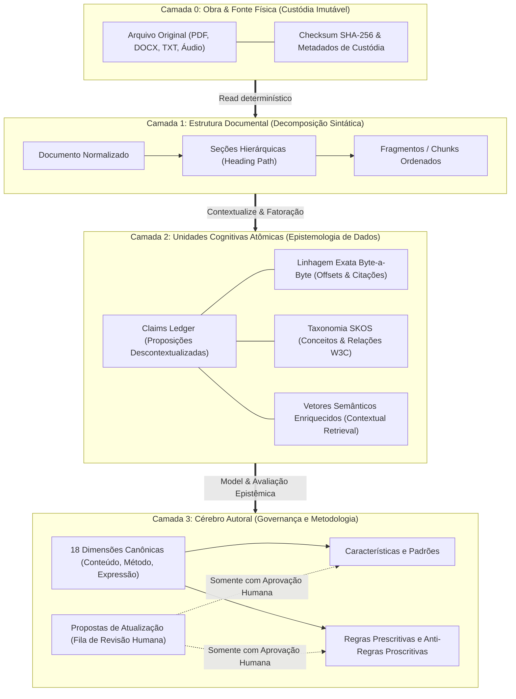

# CONSTITUIÇÃO COGNITIVA V1 — O CÉREBRO REFLEX
### Norma Canônica de Engenharia Epistêmica, Processamento Documental e Governança Autoral
**Status:** Normativo e Canônico | **Versão:** 1.0.0 | **Data:** 20 de setembro de 2026  
**Documento de Origem:** Missão `NEXT-COGNITIVE-CONSTITUTION-RCMO` (`TP-RCMO-00`)  
**Autoridade Soberana:** Usuário  
**Articulação Técnica Tripartite:** Antigravity 2.0 (Local), Claude Code Cloud, OpenAI Codex  

---

## 1. PREÂMBULO E PRINCÍPIOS FUNDAMENTAIS

O **App Reflex 02** é uma plataforma de cognição e autoria aumentada cujo valor reside na fidelidade irrestrita à metodologia, ao pensamento e à voz autoral de seu criador.

A inteligência do sistema não é um gerador autônomo de ficções, mas uma prótese reflexiva e mnemônica. Desta premissa decorrem quatro postulados fundamentais:

1. **O Monopólio Autoral Humano:**
   Nenhuma descoberta, inferência, correlação estatística ou sugestão formulada por modelos de inteligência artificial torna-se memória autoral consolidada sem autorização explícita, deliberada e soberana do autor humano. A IA propõe; somente o ser humano confirma.
2. **A Primazia da Evidência Atômica:**
   Nenhuma afirmação sobre o pensamento do autor pode subsistir desprovida de âncora textual, temporal ou contextual direta no corpus de suas obras ou relatos orais.
3. **A Honestidade Epistêmica e o Direito à Abstenção:**
   Um sistema que se recusa a inventar quando não sabe é infinitamente superior a um sistema que alucina com eloquência. A abstenção fundamentada não é falha; é o mais alto grau de rigor cognitivo.
4. **O Isolamento Físico de Inferências (Memory-Inference Firewall):**
   O que o autor expressou e o que a máquina deduziu a partir de sua expressão habitam universos ontológicos distintos e jamais poderão ser fundidos silenciosamente no mesmo espaço de recuperação.

---

## 2. TOPOLOGIA ONTOLÓGICA EM QUATRO CAMADAS

A cognição do App Reflex 02 é dividida em quatro camadas físicas e lógicas rigorosamente separadas:



### 2.1. Camada 0: Obra e Fonte Física
- **Tabelas do Banco:** `biblioteca.obras`, `biblioteca.fontes_obras`, `biblioteca.versoes_obra`.
- **Natureza:** Custódia passiva e imutável.
- **Invariante:** O texto original do autor e os binários originais jamais sofrem alteração pelo motor de inteligência artificial. Cada fonte possui digest SHA-256 calculado no momento do upload.

### 2.2. Camada 1: Estrutura Documental
- **Tabelas do Banco:** `processamento.documentos`, `processamento.secoes`, `processamento.fragmentos`.
- **Natureza:** Decomposição estrutural e determinística.
- **Invariante:** O fragmento (*chunk*) é uma unidade sintática de leitura e posicionamento geográfico no texto. Ele preserva fronteiras naturais de parágrafos. Não quebra raciocínios no meio de frases e carrega o caminho de cabeçalhos (`heading_path`) que o contextualiza.

### 2.3. Camada 2: Unidades Cognitivas Atômicas
- **Tabelas do Banco:** `processamento.claims`, `processamento.claim_provenance`, `processamento.vetores`, `taxonomia.conceitos`, `taxonomia.relacoes`.
- **Natureza:** Proposições verificáveis descontextualizadas (*Atomic Claims*), anotações semânticas e taxonomia ontológica.
- **Invariante:** O Claim é a menor unidade de verdade independente do documento. Cada claim carrega obrigatoriamente sua proveniência exata: ID do fragmento, offset de início (`inicio_char`), offset de fim (`fim_char`), citação textual idêntica e vetor de confiança multidimensional.

### 2.4. Camada 3: Cérebro Autoral
- **Tabelas do Banco:** `cerebro_autoral.dimensoes`, `cerebro_autoral.caracteristicas`, `cerebro_autoral.regras`, `cerebro_autoral.propostas_atualizacao`.
- **Natureza:** Metodologia de pensamento, interpretação e redação do autor.
- **Invariante:** As características e regras ativas pertencem exclusivamente ao autor. Todo evento de aprendizado (seja por processamento de texto ou por edição autoral comparativa) gera entradas na tabela `propostas_atualizacao` com estado `proposta`. É **terminantemente vedada** a inserção de características confirmadas diretamente pela IA sem a chancela do usuário soberano.

---

## 3. O CICLO COGNITIVO RCMO (Read-Contextualize-Model-Output)

O processamento cognitivo do Reflex rege-se pelo protocolo de 4 tempos **RCMO**:

```
┌──────────────────────────────────────────────────────────────────────────┐
│                                CICLO RCMO                                │
├──────────────┬──────────────────┬──────────────────┬─────────────────────┤
│   R — READ   │ C — CONTEXTUALIZE│    M — MODEL     │     O — OUTPUT      │
├──────────────┼──────────────────┼──────────────────┼─────────────────────┤
│ Normalização │ Enriquecimento   │ Descontextualiza-│ Dossiê Contextual   │
│ e extração   │ contextual com   │ ção em Claims;   │ e Auditoria prévia; │
│ determinís-  │ contexto pai;    │ Validação NLI    │ Firewall de         │
│ tica;        │ Limites de       │ Entailment;      │ Inferência;         │
│ Validação de │ parágrafo sem    │ Indexação densa  │ Síntese autoral ou  │
│ integridade. │ truncamento.     │ e esparsa (RRF). │ Abstenção Honesta.  │
└──────────────┴──────────────────┴──────────────────┴─────────────────────┘
```

### 3.1. Fase R: Read (Leitura e Normalização)
1. **Extração Isenta:** Extrai o texto preservando a formatação original e os marcadores estruturais.
2. **Rejeição Ativa de Lixo:** Arquivos corrompidos, binários sem suporte ou PDFs digitalizados sem OCR são imediatamente rejeitados com erro determinístico explícito, impedindo que lixo semântico entre no fluxo.
3. **Preservação de Paginação e Posição:** Armazenamento de offsets físicos absolutos para viabilizar rastreamento em auditorias.

### 3.2. Fase C: Contextualize (Contextualização e Segmentação)
1. **Chunking Respeitoso:** Segmentação em fragmentos com base em fronteiras semânticas naturais (parágrafos e seções), com baseline experimental alvo entre 1.000 e 1.500 caracteres, sem quebra cega no meio de sentenças.
2. **Contextual Retrieval Enrichment:** Cada fragmento é prefixado com um resumo contextual sucinto (50 a 100 palavras) situando sua posição na obra e na seção, garantindo que termos anafóricos (ex: *"isso aconteceu naquela época"*) sejam compreensíveis no isolamento vetorial.

### 3.3. Fase M: Model (Modelagem e Alinhamento Epistêmico)
1. **Fatoração em Claims Atômicos:** Extração de proposições declarativas singulares a partir dos fragmentos.
2. **Validação NLI (Natural Language Inference):** Verificação de entailment entre a frase original e o claim descontextualizado. Regra mandatória: *se há ambiguidade na inferência, o claim não é extraído*.
3. **Classificação nos 10 Estados Epistemológicos:** Todo elemento de conhecimento recebe um rótulo formal de certeza e origem.
4. **Cálculo do Vetor de Confiança:** Avaliação dos 10 parâmetros multidimensionais de solidez empírica.
5. **Vetorização Híbrida:** Geração de embedding vetorial denso e tokens léxicos para indexação com Reciprocal Rank Fusion (RRF).

### 3.4. Fase O: Output (Síntese, Governança e Abstenção)
1. **Montagem do Dossiê Contextual:** Agrupamento e ordenação de fragmentos e claims recuperados dentro do orçamento de tokens da tarefa.
2. **Memory-Inference Firewall Check:** O orquestrador assegura que inferências e hipóteses sejam rotuladas explicitamente como tais no prompt, separadas das memórias confirmadas.
3. **Auditoria Prévia (R6 / A7):** Avaliação de alinhamento com a voz autoral e conferência de alucinações.
4. **Abstenção Honesta:** Caso o Dossiê não atinja os requisitos mínimos de sustentação, o sistema emite uma das 7 modalidades de abstenção em vez de inventar uma resposta.

---

## 4. SISTEMA DE GOVERNANÇA EPISTÊMICA

### 4.1. Os 10 Estados Epistemológicos Canônicos

Toda entidade cognitiva no Reflex 02 possui um e apenas um dos seguintes estados:

| Estado | Significado Epistêmico | Nível de Autoridade |
| :--- | :--- | :---: |
| `observed` | Fato bruto verificado em documento primário sem interpretação. | Alta |
| `quoted` | Citação literal do autor preservada palavra por palavra. | Máxima |
| `extracted` | Proposição extraída diretamente do texto via descontextualização NLI. | Alta |
| `consolidated` | Padrão identificado após múltiplas ocorrências comprovadas no corpus. | Alta |
| `confirmed_authorial` | Característica, regra ou conceito formalmente aprovado pelo Autor. | Soberana |
| `inferred` | Dedução lógica realizada pelo modelo de linguagem. | Provisória |
| `hypothesized` | Hipótese explicativa gerada pelo sistema para teste. | Experimental |
| `proposed` | Sugestão de regra ou padrão aguardando decisão humana na fila. | Pendente |
| `rejected` | Proposição formalmente refutada ou descartada pelo Autor. | Nula |
| `superseded` | Fato ou regra anterior que foi superada pela evolução autoral. | Histórica |

### 4.2. O Memory-Inference Firewall

O **Memory-Inference Firewall** é a salvaguarda que impede que o modelo confunda *o que ele acha que o autor pensa* com *o que o autor de fato escreveu*.

```
   [ Corpus e Memórias Confirmadas ] ──────────┐
                                               ▼
                                      ┌────────────────┐
                                      │ WORKING MEMORY │ ──► [ Resposta Autêntica ]
                                      └────────────────┘
   [ Deduções e Inferências da IA ] ───────────┼────────────► BLOQUEADO PELO FIREWALL
                                               │              (Sem rótulo explícito)
                                               ▼
                                  [ Rótulo: "Hipótese de IA" ]
```

* **Regra de Ouro do Firewall:** Toda inferência (`inferred`, `hypothesized`, `proposed`) injetada no contexto de raciocínio deve ser explicitamente precedida pelo marcador de advertência: `[INFERÊNCIA DA IA — NÃO CONFIRMADA PELO AUTOR]`.
* **Métrica de Violação (MILR - Memory-Inference Leakage Rate):** Percentual de respostas em que deduções foram apresentadas como fatos autorais sem advertência. Meta constitucional: **MILR = 0,0%**.

### 4.3. Taxonomia das Sete Formas de Abstenção Honesta

Quando o sistema não dispuser de sustentação suficiente no corpus, ele **não alucinará**. Em vez disso, adotará uma das 7 modalidades canônicas de abstenção:

1. **`ABST_NO_EVIDENCE` (Ausência de Evidência):**
   O corpus não contém menções suficientes sobre o tema solicitado. O sistema informa abertamente que não há registro autoral disponível.
2. **`ABST_CONFLICTING` (Evidência Conflitante / Dialética Aberta):**
   O autor possui posições divergentes registradas em épocas ou contextos distintos. O sistema expõe a tensão sem tomar partido artificialmente.
3. **`ABST_ONLY_INFERRED` (Evidência Puramente Inferida):**
   A única sustentação encontrada deriva de deduções probabilísticas do modelo, sem ancoragem direta em palavras do autor. O sistema recusa a síntese categórica.
4. **`ABST_OUT_OF_SCOPE` (Fora de Escopo Autoral):**
   A consulta exige pronunciamento sobre temas alheios ao universo conceitual do autor.
5. **`ABST_LOW_CONFIDENCE` (Baixa Confiança Agregada):**
   O Vetor de Confiança agregado não atinge o limiar mínimo calibrado para a tarefa.
6. **`ABST_DIRECTIVE_RISK` (Risco de Violação de Diretriz Autoral):**
   A formulação solicitada incita o sistema a infringir uma anti-regra proscritiva explícita do Cérebro Autoral.
7. **`ABST_CLARIFICATION_REQUIRED` (Necessidade de Alinhamento Humano):**
   A instrução apresenta ambiguidades substanciais que requerem direcionamento soberano antes do processamento.

---

## 5. O VETOR DE CONFIANÇA DE DEZ DIMENSÕES

A confiabilidade não é um número arbitrário (ex: 0,92). Ela é decomposta em um vetor ortogonal de 10 dimensões avaliadas para cada claim ou padrão:

$$\mathbf{C} = \langle c_1, c_2, c_3, c_4, c_5, c_6, c_7, c_8, c_9, c_{10} \rangle$$

1. **`support` ($c_1$):** Grau de sustentação direta em texto literal ($0.0$ a $1.0$).
2. **`provenance` ($c_2$):** Qualidade da linhagem rastreada (fonte primária vs secundária).
3. **`independence` ($c_3$):** Existência de múltiplas fontes distintas corroborando a afirmação.
4. **`author_confirmation` ($c_4$):** Selo explícito de validação humana ($1.0$ se confirmado, $0.0$ caso contrário).
5. **`temporal_fit` ($c_5$):** Atualidade e posicionamento na linha de evolução do autor.
6. **`scope_fit` ($c_6$):** Aderência temática ao domínio da obra em questão.
7. **`retrieval_stability` ($c_7$):** Consistência do claim quando submetido a diferentes estratégias de busca.
8. **`contradiction_load` ($c_8$):** Carga de contra-evidências existentes no corpus ($0.0$ indica ausência de contradição).
9. **`model_agreement` ($c_9$):** Concordância entre múltiplos modelos avaliadores (Antigravity, Claude, Codex).
10. **`historical_utility` ($c_{10}$):** Histórico de aceitação pelo autor em sínteses anteriores.

---

## 6. CLASSIFICAÇÃO NORMATIVA DE PARÂMETROS

Todos os valores escalares do sistema cognitivo são formalmente tipificados como **`BASELINE EXPERIMENTAL`**.

Nenhum parâmetro é imutável a priori; todos são sujeitos a calibração sistemática através do **Golden Dataset (12 Famílias CBR)**:
* Orçamento de Tokens da Working Memory (2k a 16k tokens);
* Limiares de similaridade e abstenção ($\tau$);
* Multiplicadores de peso autoral;
* Número de recorrências necessárias para disparar propostas de padrão;
* Tamanho médio de janelas de fragmentação.

---

## 7. CLÁUSULA DE SOBERANIA E DISPOSIÇÕES FINAIS

Esta Constituição Cognitiva V1 é o documento máximo de referência para o desenvolvimento e evolução do pipeline de inteligência do App Reflex 02.

Qualquer alteração em seus princípios requer revisão tripartite documentada e aprovação expressa do Usuário Soberano.
