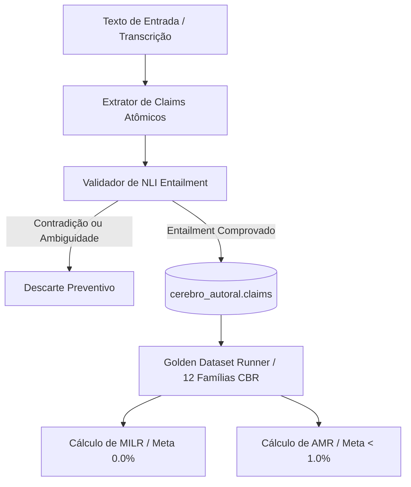

# Design Freeze Cognitivo V3.1 — App Reflex 02

**Missão:** MIS-0006 — Fechamento Conclusivo da Pesquisa, Design Freeze e Plano Mestre Executável  
**Data do Congelamento:** 18 de setembro de 2026  
**Status:** `DESIGN CONGELADO / ESPECIFICAÇÃO NORMATIVA VINCULANTE`  
**Autoridade:** A1 (Arquitetura), A5 (IA & Conhecimento), A7 (QA & AppSec), A9 (Continuidade & Evidências)  
**Documentos Vinculados:** `DECISION_MATRIX_FINAL_V3_1.md`, `PLANO_MESTRE_MODERNIZACAO_COGNITIVA_V3_1.md`, ADR 0002, ADR 0003  

---

## 1. Declaração Formal de Design Freeze

Fica formalmente declarado o **Design Freeze** da Arquitetura Cognitiva V3.1 do App Reflex 02. A partir desta data:

1. **Encerramento da Fase Exploratória:** Nenhuma nova pesquisa teórica, levantamento exploratório ou proposta arquitetural divergente será iniciada até a conclusão e homologação das 6 Waves do Plano Mestre;
2. **Imutabilidade dos Contratos Epistêmicos:** Os 14 Invariants Cognitivos, as estruturas de dados fundamentais (Claims Ledger, Event Ledger, SKOS) e os gates de liberação técnica tornam-se regras mandatórias e inegociáveis para todos os 9 agentes;
3. **Escopo Executável:** Qualquer dúvida ou variação empírica que surja durante o desenvolvimento das Waves será resolvida estritamente pelo ciclo `HIPÓTESE → EXPERIMENTO (SANDBOX) → MÉTRICA → DECISÃO (A1/A7)`.

---

## 2. Os 14 Invariants Cognitivos Inegociáveis

Os 14 Invariants abaixo regem todo o código, prompts, schemas e migrations desenvolvidos para o sistema cognitivo do App Reflex 02:

### INVARIANT 01: Soberania Autoral Inviolável
O pensamento, as obras e os áudios do autor constituem a fonte primária de verdade ontológica do sistema. A IA atua como assistente reflexivo, sintetizador e arquivista, jamais como substituto criativo ou autoridade dogmática sobre o que o usuário pensa ou sentiu.

### INVARIANT 02: Segregação Absoluta (Memory-Inference Firewall)
Crenças autorais confirmadas e inferências estatísticas geradas por LLM pertencem a domínios ontológicos estritamente segregados. Uma hipótese, dedução ou conexão latente sugerida pela IA jamais entra na memória canônica do autor sem aprovação explícita e deliberada do usuário.

### INVARIANT 03: Proveniência Auditável de Claims
Nenhum claim (asserção atômica) pode existir na base de dados cognitiva sem um ponteiro de proveniência completo e verificável:
$$\text{Provenance}(c) = \langle \text{source\_id}, \text{span\_start}, \text{span\_end}, \text{content\_hash}, \text{created\_at} \rangle$$
Se o texto original de uma obra for editado ou excluído, os claims dependentes devem ser recalculados ou sinalizados como desprovidos de âncora factual.

### INVARIANT 04: Regra *Ambiguidade $\to$ Não Extrai*
Na extração automatizada de claims a partir de textos ou transcrições, caso haja ambiguidade semântica, dúvida sintática ou falta de implicação lógica rigorosa (Entailment), o extrator cognitivo deve **abster-se de gerar o claim**. Uma base menor com alta precisão é infinitamente superior a uma base densa com ruído ou alucinação.

### INVARIANT 05: Zero Mutação Silenciosa de Crenças
O sistema está estritamente proibido de realizar alterações, reclassificações ou atualizações silenciosas nas dimensões centrais do Cérebro Autoral (`cerebro_autoral.dimensoes` ou tabelas correlatas). Toda evolução decorrente de consolidação, novas obras ou aprendizado por edição deve gerar uma proposta estruturada para revisão humana.

### INVARIANT 06: Primazia da Abstenção Honesta
Se o acervo autoral não contiver informações suficientes para responder a uma indagação reflexiva, o sistema deve acionar formalmente uma das 7 modalidades de abstenção honesta. Apresentar respostas plausíveis, porém desprovidas de ancoragem documental, é classificado como falha crítica de integridade.

### INVARIANT 07: Dossiê Contextual Segregado com `Allowed Use`
A montagem da memória de trabalho (Working Memory) para a geração de reflexões deve injetar o contexto segregado em compartimentos estanques (Núcleo Autoral, Influências Externas, Linha do Tempo e Taxonomia). Cada bloco recebe tags obrigatórias de `Allowed Use` que restringem o papel do modelo (ex.: `CITE_ONLY`, `BACKGROUND_INFLUENCE`, `CANONICAL_AUTHOR_BELIEF`).

### INVARIANT 08: Validação Estruturada Obrigatória via Schemas Zod
Toda e qualquer saída produzida por modelos de linguagem (extração de claims, classificação taxonômica, propostas de aprendizado e metadados de reflexão) deve ser validada estruturalmente em tempo de execução via schemas Zod rígidos. Respostas em texto livre sem validação estrutural são rejeitadas na borda do sistema.

### INVARIANT 09: Isolamento Criptográfico e Multi-Tenant via RLS
Toda e qualquer leitura ou escrita no banco de dados deve operar sob políticas ativas de Row Level Security (RLS) no PostgreSQL 17. O acesso por `service_role` é restrito a jobs em batch e workers de background devidamente auditados, sendo expressamente proibido para endpoints anônimos ou de cliente.

### INVARIANT 10: Veracidade Estrita da Telemetria (Zero Simulação)
Métricas de processamento, custos de tokens, contagens de claims, tempos de inferência e resultados de testes não podem, em hipótese alguma, ser mockados ou simulados para aprovação de pipelines. Dados de telemetria apresentados em laudos devem provir de execuções reais no ambiente de teste ou produção.

### INVARIANT 11: Recuperação Híbrida Multi-Sinal Equilibrada
O retrieval não pode depender exclusivamente de proximidade vetorial em espaço denso. O ranking de recuperação deve combinar pontuação densa (`pgvector`), correspondência léxica lematizada em língua portuguesa (FTS com dicionário PT), decaimento temporal e ponderação por peso de autoridade epistêmica.

### INVARIANT 12: Taxonomia Formal SKOS
A taxonomia de conceitos deve seguir as relações padronizadas pelo W3C Simple Knowledge Organization System (`skos:broader`, `skos:narrower`, `skos:related`). Relações taxonômicas ad-hoc sem semântica formal são proibidas, garantindo interoperabilidade e navegação conceitual determinística.

### INVARIANT 13: Golden Dataset de 12 Famílias como Release Gate
Nenhuma alteração em modelos, prompts ou algoritmos de retrieval/extração pode ser promovida sem aprovação total na suíte de testes do Golden Dataset V3 (12 famílias de casos baseados em raciocínio - CBR), assegurando regressão zero de qualidade e segurança epistêmica.

### INVARIANT 14: Rastreabilidade Tripartite Contínua (Harness V2 / A9)
Toda missão, decisão de arquitetura e evolução de código deve ser documentada com evidências verificáveis (`[CONFIRMADO-TESTE]`, `[CONFIRMADO-CODIGO]`, `[CONFIRMADO-CI]`), preservando o histórico tripartite (Usuário ↔ ChatGPT ↔ Antigravity) através dos relatórios de handoff emitidos por A9.

---

## 3. Especificação do Cognitive MVP-1 (Wave 1)

O **Cognitive MVP-1** define o menor conjunto atômico e testável de componentes necessários para instituir a integridade epistêmica da V3.1:

### Componentes Integrantes do Cognitive MVP-1:
1. **Schema de Banco:** Criação das tabelas `cerebro_autoral.claims`, `cerebro_autoral.claim_provenance` e enum `epistemic_state` via migration canônica de A4;
2. **Motor de Extração e Descontextualização:** Módulo TypeScript baseado nos princípios do Claimify com resolução de anáforas e geração de claims independentes de contexto;
3. **Classificador de Entailment (NLI):** Avaliador que submete o par `(Premissa: Span Original, Hipótese: Claim Atômico)` ao critério estrito de entailment;
4. **Harness de Evals (Golden Dataset Runner):** Script automatizado em Vitest executando as 12 famílias CBR e gerando relatórios com as métricas MILR e AMR.

---

## 4. Definições Canônicas de MILR e AMR

### 4.1. Taxa de Vazamento de Memória-Inferência (MILR)

O **MILR (Memory-Inference Leakage Rate)** mede a vulnerabilidade do sistema cognitivo a tratar deduções probabilísticas como memórias fáticas do autor.

#### Formulação Matemática:
Seja $\mathcal{C}_{\text{inferred}}$ o conjunto de todos os claims gerados a partir de inferência estatística, síntese ou sumarização da IA. O MILR é a razão entre os claims inferidos que vazaram indevidamente para a memória canônica/estável sem ancoragem documental direta e o total de claims inferidos:

$$\text{MILR} = \frac{\left| \left\{ c \in \mathcal{C}_{\text{inferred}} : \text{state}(c) \in \{\text{CANONICAL\_FACT}, \text{STABLE\_ACTIVE}\} \land \text{evidence}(c) = \emptyset \right\} \right|}{\left| \mathcal{C}_{\text{inferred}} \right|} \times 100\%$$

#### Diferenciação Contratual:
- **No Golden Dataset Fechado (Release Gate):** $\text{MILR}_{\text{gate}} \equiv 0.0\%$. Se houver 1 único vazamento entre os casos de teste controlados, o build e a release são automaticamente **abortados** por A7;
- **Em Corpus Aberto / Produção:** Métrica amostral auditada assincronamente por amostragem estratificada, com alerta disparado para A1 e A5 se $\text{MILR} > 0.05\%$.

---

### 4.2. Taxa de Falsa Atribuição de Autoria (AMR)

O **AMR (Authorial Misattribution Rate)** mede a frequência com que o sistema atribui erroneamente ao autor ideias, opiniões, dados ou citações que provêm de fontes externas (livros de terceiros, artigos, documentos de referência) ou da própria imaginação do modelo.

#### Formulação Matemática:
Seja $\mathcal{A}_{\text{author}}$ o conjunto de todas as afirmações presentes em reflexões ou respostas geradas pela IA onde o sujeito é formalmente identificado como o autor (ex.: "Você defende que...", "Em seu pensamento...", "Como você escreveu..."):

$$\text{AMR} = \frac{\left| \left\{ a \in \mathcal{A}_{\text{author}} : \text{source\_type}(\text{anchor}(a)) \neq \text{AUTHORIAL\_PRIMARY} \right\} \right|}{\left| \mathcal{A}_{\text{author}} \right|} \times 100\%$$

#### Tolerância e Governança:
- **No Golden Dataset Fechado:** $\text{AMR}_{\text{gate}} \equiv 0.0\%$;
- **Em Produção:** Tolerância máxima $\text{AMR} < 1.0\%$. Quando uma ideia externa influenciar o raciocínio, a resposta deve explicitar a origem externa (ex.: "Inspirado em Foucault, você ponderou...").

---

## 5. Assinaturas e Compromisso de Engenharia

O Design Freeze foi homologado e submetido aos branches do projeto com garantia de observância estrita pelos agentes A1 a A9.
