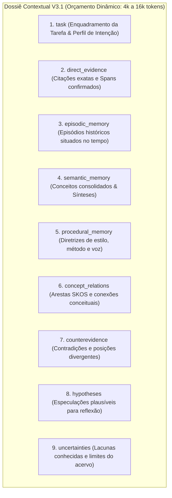

# DOSSIÊ CONTEXTUAL V3.1 — WORKING MEMORY DO CÉREBRO REFLEX
### A Montagem da Janela de Contexto, Orçamentos Rígidos e Políticas de Allowed Use
**Missão:** MIS-0005 | **Status:** Normativo e Conceitual | **Data:** 2026-09-18

---

## 1. O Conceito de Dossiê Contextual

O **Dossiê Contextual V3.1** é a materialização computacional da **Memória Operacional (Working Memory)** do sistema.
Em vez de injetar uma lista corrida de chunks recuperados no prompt do modelo de linguagem (prática típica de RAG ingênuo), o Dossiê organiza o conhecimento em **compartimentos semânticos estanques**, onde cada elemento carrega seus metadados de custódia e suas restrições operacionais de uso (**Allowed Use**).

---

## 2. A Estrutura dos 9 Compartimentos Orçados

O Dossiê é dividido em 9 seções com orçamentos de tokens calculados para impedir o transbordamento da janela de contexto e o enfraquecimento da atenção do modelo (*Lost in the Middle*):



### Matriz de Compartimentos e Orçamento Típico:

| Compartimento | Função Principal | Orçamento Típico (8k Budget) | Tipos Epistêmicos Permitidos |
|---|---|:---:|---|
| **`task`** | Define o objetivo, perfil de intenção e regras de saída. | ~500 tokens | Metadados de Sistema |
| **`direct_evidence`** | Fragmentos literais que servem de prova direta para claims. | ~2.500 tokens | `quoted`, `extracted` |
| **`episodic_memory`** | Contextos históricos e episódios passados com datação. | ~1.500 tokens | `observed`, `extracted` |
| **`semantic_memory`** | Teses e sínteses consolidadas pelo sistema. | ~1.200 tokens | `consolidated` |
| **`procedural_memory`** | Regras ativas de redação, estilo e método do autor. | ~600 tokens | `confirmed_authorial` |
| **`concept_relations`** | Relações taxonômicas e conexões conceituais ativas. | ~500 tokens | Grafo / SKOS |
| **`counterevidence`** | Notas que contradizem ou tensionam a tese em discussão. | ~600 tokens | `contradiction` |
| **`hypotheses`** | Especulações sugeridas para exploração criativa. | ~350 tokens | `hypothesized` |
| **`uncertainties`** | Mapeamento explícito de lacunas temáticas do acervo. | ~250 tokens | Metamemória |

---

## 3. Esquema Formal de Item do Dossiê

Cada elemento inserido em qualquer compartimento do Dossiê deve respeitar a estrutura de objeto:

```json
{
  "dossier_item_id": "item_001_chk_45",
  "memory_type": "episodic_memory",
  "epistemic_status": "extracted",
  "source_ids": ["doc_caderno_2024", "chunk_45"],
  "retrieval_route": "dense_plus_lexical",
  "retrieval_score": 0.892,
  "temporal_fit": 0.94,
  "authorial_scope": "nucleo_autoral",
  "confidence_vector": {
    "support": 0.95,
    "provenance": 1.0,
    "independence": 0.80,
    "author_confirmation": 1.0,
    "temporal_fit": 0.94,
    "scope_fit": 0.90,
    "retrieval_stability": 0.85,
    "contradiction_load": 0.0,
    "model_agreement": 0.95,
    "historical_utility": 0.70
  },
  "allowed_use": [
    "CAN_SUPPORT_AUTHORIAL_CLAIM",
    "CAN_BE_CITED_DIRECTLY"
  ],
  "conteudo": "Em maio de 2024, após a leitura de Heidegger, registrei que a técnica moderna reduz o mundo a recurso disponível."
}
```

---

## 4. Políticas Normativas de Allowed Use

Para garantir que o LLM não utilize informações além da autorização permitida pelo seu status epistêmico, são aplicadas as seguintes diretrizes:

### 1. Política para Fontes Externas de Terceiros (`external_source`)
-  `CAN_SUPPORT_EXTERNAL_CLAIM` (Pode ser citado como: *"Freud afirma que..."*)
- ❌ `CANNOT_SUPPORT_AUTHORIAL_CLAIM` (Não pode ser usado para dizer: *"Você concluiu que..."*)

### 2. Política para Regras Procedurais (`procedural_rule`)
-  `CAN_GUIDE_STYLE` (Deve calibrar cadência, tom e vocabulário da resposta)
-  `CAN_SUGGEST_STRUCTURE` (Deve moldar os tópicos ou seções)
- ❌ `CANNOT_SUPPORT_FACT` (Não pode ser citada como fato histórico ou empírico)

### 3. Política para Hipóteses e Inferências (`hypothesis` / `inferred`)
-  `CAN_INSPIRE_QUESTION` (Pode sugerir perguntas reflexivas ao autor)
-  `CAN_BE_PROPOSED_AS_CONJECTURE` (Pode ser apresentada com prefixo dubitativo)
- ❌ `CANNOT_BE_STATED_AS_MEMORY` (Jamais pode ser tratada como memória lembrada)
- ❌ `CANNOT_BE_ASSERTED_AS_CERTAINTY` (Jamais pode ser formulada em tom categórico)
