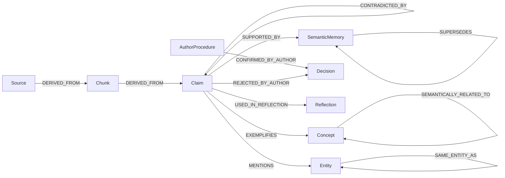

# GRAFO EPISTEMOLÓGICO TEMPORAL — CÉREBRO REFLEX V3.1
### Topologia Lógica, Ontologia de Arestas, Temporalidade Bitemporal e Separação Taxonômica
**Missão:** MIS-0005 | **Status:** Normativo e Conceitual | **Data:** 2026-09-18

---

## 1. Separação Fundamental: Taxonomia vs. Grafo Epistemológico

No Reflex V3.1, a representação do conhecimento é estritamente particionada em duas camadas que não devem ser confundidas:

```
┌─────────────────────────────────────────────────────────────┐
│ 1. CAMADA TAXONÔMICA (SKOS W3C)                             │
│ "Que conceito é este no vocabulário?"                       │
│ Foco: Nomenclatura, categorização, hierarquia estrita       │
│ Relações: prefLabel, altLabel, broader, narrower, related   │
└──────────────────────────────┬──────────────────────────────┘
                               │ Ancoragem Semântica
                               ▼
┌─────────────────────────────────────────────────────────────┐
│ 2. CAMADA DO GRAFO EPISTEMOLÓGICO TEMPORAL                  │
│ "Como sabemos disso, quando foi dito e como se relaciona?"  │
│ Foco: Evidências, claims, temporalidade, contradições e uso │
│ Relações: DERIVED_FROM, SUPPORTED_BY, CONTRADICTED_BY, etc. │
└─────────────────────────────────────────────────────────────┘
```

A Taxonomia é uma estrutura controlada e enxuta para catalogação de temas. O Grafo Epistemológico é a rede dinâmica e viva de pensamento, onde claims emergem, entram em conflito, são refinados e evoluem com o passar dos anos.

---

## 2. A Topologia dos 13 Tipos de Nós

O grafo epistemológico é composto por 13 entidades primárias:

| # | Tipo de Nó | Descrição | Exemplo Concreto |
|---|---|---|---|
| **1** | `Source` | Documento, livro, transcrição de áudio ou caderno original. | "Caderno de Filosofia 2024.pdf" |
| **2** | `SourceVersion` | Snapshot imutável de uma fonte após revisão ou edição. | Versão 2 (após correção de OCR) |
| **3** | `Chunk` | Recorte textual contextualizado para leitura e embedding. | Chk_881 (parágrafos 12 a 15) |
| **4** | `Claim` | Proposição verificável e descontextualizada. | Clm_102 ("A técnica precede a reflexão") |
| **5** | `Concept` | Nó taxonômico conceitual (SKOS Concept). | Conceito "Alienação Tecnológica" |
| **6** | `Entity` | Pessoa, lugar, livro citado ou organização mencionada. | "Martin Heidegger", "Ser e Tempo" |
| **7** | `SemanticMemory` | Conhecimento de síntese consolidado multi-episódios. | Síntese de 5 anos de leitura sobre técnica |
| **8** | `AuthorProcedure`| Regra de método, estilo ou conduta intelectual. | "Revisar manuscrito com voz alta" |
| **9** | `Episode` | Evento situado no tempo (gravação, sessão de escrita). | Sessão de áudio gravada em 12/03/2025 |
| **10**| `Reflection` | Texto gerado pelo autor em conjunto com a IA. | Ensaio reflexivo #42 |
| **11**| `Decision` | Decisão explícita tomada pelo autor no sistema. | Decisão de rejeitar regra de estilo |
| **12**| `Consolidation` | Registro do ato de consolidação que agrupou memórias. | Job de consolidação semântica #12 |
| **13**| `Contradiction` | Objeto de primeira classe que documenta um conflito. | Tensão entre notas de 2023 e 2025 |

---

## 3. As 12 Arestas Epistemológicas e seus Metadados

Toda aresta que interliga nós no grafo possui tipagem semântica estrita e carrega metadados probatórios:



### Metadados Obrigatórios em Cada Aresta:
```json
{
  "edge_type": "CONTRADICTED_BY",
  "from_node": "claim_01",
  "to_node": "claim_02",
  "epistemic_status": "consolidated",
  "evidence_ids": ["chk_12", "chk_94"],
  "origin": "contradiction_detector_v1",
  "created_at": "2026-09-18T22:30:00Z",
  "valid_from": "2025-01-01T00:00:00Z",
  "valid_to": null,
  "confidence_components": { "support": 0.92, "temporal_fit": 0.88 },
  "model_version": "gpt-4o",
  "scope": "metodologia_escrita"
}
```

---

## 4. O Princípio de Pattern Separation: Similaridade $\neq$ Merge

> [!IMPORTANT]
> **REGRA DE OURO DA MEMÓRIA:**  
> **Alta similaridade semântica NÃO causa fusão (merge) de nós.**

Em grafos ingênuos de IA, quando dois claims são parecidos, o sistema funde os nós em um só. No Reflex V3.1, adota-se o princípio neurobiológico da **Separação de Padrões (Pattern Separation)**:
- Se o autor disse algo similar em 2023 e em 2025, os dois episódios e claims **permanecem rigorosamente distintos**.
- O que une os dois nós é uma aresta de relacionamento (`SEMANTICALLY_RELATED_TO`) ou um terceiro nó de síntese (`SemanticMemory`), mantendo as identidades e proveniências originais intactas.

---

## 5. Temporalidade Bitemporal no Grafo

Para entender a evolução do pensamento sem cair em anacronismos, o Reflex V3.1 adota modelagem **bitemporal**:

1. **Tempo de Validade do Pensamento (Valid Time):**
   - `valid_from`: Quando a afirmação passou a refletir a visão do autor.
   - `valid_to`: Quando a visão foi modificada ou revogada (nulo se ainda ativa).
2. **Tempo de Registro no Sistema (Transaction Time):**
   - `observed_at`: Momento exato em que o episódio ocorreu na vida real.
   - `ingested_at`: Momento em que o documento foi processado no banco.
   - `superseded_at`: Momento em que um novo fato superou o anterior no sistema.

---

## 6. O Objeto Contradição como Cidadão de Primeira Classe

Contradições não são bugs a serem eliminados; no trabalho intelectual autoral, contradições representam **amadurecimento de ideias e dialética**. Cada tensão identificada é persistida como um objeto estruturado:

```json
{
  "contradiction_id": "ctrd_881920",
  "claim_a_id": "clm_102_trabalho_solitario",
  "claim_b_id": "clm_405_trabalho_colaborativo",
  "tipo": "temporal_evolution",
  "scope_overlap": "metodologia_pesquisa",
  "temporal_relation": "claim_b_posterior_a_claim_a",
  "evidence_a": ["doc_diario_2023_p12"],
  "evidence_b": ["doc_ensaio_2025_p4"],
  "resolution_status": "open_tension",
  "resolution_basis": "O autor mudou de perspectiva após a criação do laboratório coletivo em 2024.",
  "human_decision": null
}
```

### Tipos Canônicos de Contradição:
1. `factual_conflict`: Inconsistência de datas ou fatos brutos entre documentos.
2. `temporal_evolution`: O autor pensava A em 2022 e passou a pensar B em 2025.
3. `source_disagreement`: Dois autores externos citados divergem sobre a mesma teoria.
4. `conceptual_refinement`: Uma visão geral foi refinada em termos mais precisos.
5. `contextual_preference`: Em contextos teóricos o autor prefere rigor; em notas livres prefere metáforas.
6. `extraction_error`: Falha de parsing ou de NLI que gerou alegação inconsistente.

---

## 7. O Event Store Imutável (`memory_events`)

Toda e qualquer mutação na rede de conhecimento do Reflex é registrada em um livro-razão somente de anexação (**append-only ledger**):

```sql
-- Especificação conceitual do Event Store
CREATE TABLE memory_events (
  id UUID PRIMARY KEY DEFAULT gen_random_uuid(),
  event_type VARCHAR(60) NOT NULL,
  entity_type VARCHAR(60) NOT NULL,
  entity_id UUID NOT NULL,
  payload JSONB NOT NULL,
  actor VARCHAR(50) NOT NULL, -- 'autor', 'pipeline_extracao', 'worker_consolidacao'
  created_at TIMESTAMPTZ DEFAULT now()
);
```

**Eventos Registrados:** `document_ingested`, `claim_extracted`, `claim_rejected`, `reflection_generated`, `reflection_edited`, `concept_proposed`, `concept_confirmed`, `rule_proposed`, `rule_confirmed`, `rule_rejected`, `contradiction_detected`, `decision_made`.
