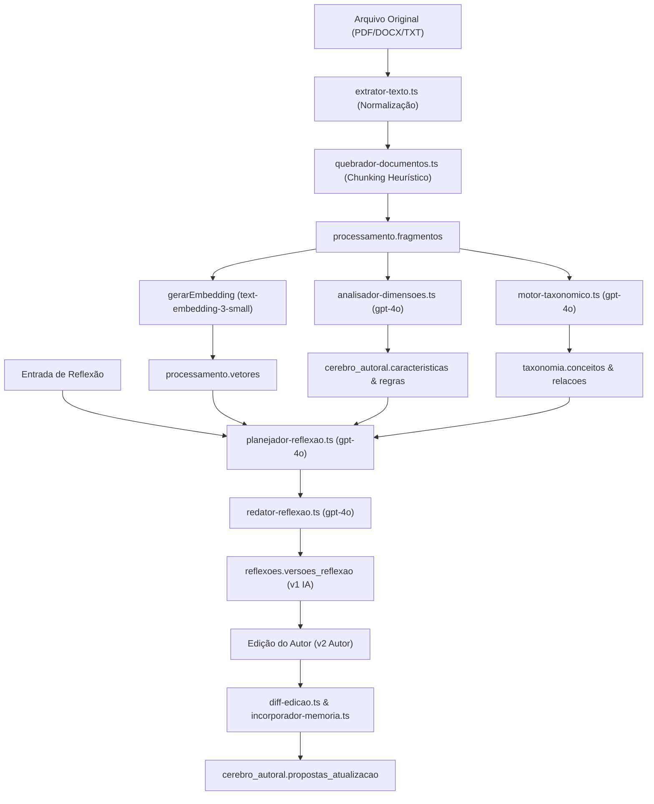

# Mapa Cognitivo Atual do App Reflex 02 — Arquitetura de Inteligência V1

**Data da Auditoria:** 18 de setembro de 2026  
**Líder Técnico:** A5 (rflex-ai-knowledge)  
**Revisão Arquitetural:** A1 (rflex-architect) & A8 (rflex-research-evolution)  
**Auditoria Independente:** A7 (rflex-qa-security)  

---

## 1. Visão Geral do Pipeline Cognitivo Atual

O fluxo cognitivo do App Reflex 02 é estruturado em duas esteiras principais:
1. **Esteira de Ingestão e Estruturação de Conhecimento (Biblioteca → Processamento → Cérebro & Taxonomia)**
2. **Esteira de Síntese e Expansão Intelectual (Entrada → Dossiê Contextual → Planejamento → Redação → Aprendizado por Edição)**

---

## 2. Inventário Detalhado Etapa por Etapa

### Etapa 1: Extração e Normalização de Texto
- **Arquivo de Código:** `src/dominios/processamento/extrator-texto.ts`
- **Input:** Buffer binário de arquivo (PDF, DOCX, TXT), MIME type, nome do arquivo.
- **Output:** `ResultadoExtracaoTexto` (`textoCompleto`, `totalPaginas`, `totalPalavras`, `metadadosArquivo`).
- **Modelo de IA:** Nenhum (processamento algorítmico / determinístico via `pdf-parse` e parser XML DOCX).
- **Fallback:** 
  - *Anterior:* Se DOCX falhasse, realizava `buffer.toString("utf-8")` gerando caracteres binários corrompidos.
  - *Atual (Corrigido na MIS-0003):* Lança exceção determinística rejeitando binários corrompidos ou não suportados.
- **Banco de Dados:** `biblioteca.fontes_obras` (`conteudo_extraido`).
- **Ponto de Falha Conhecido:** PDFs digitalizados (sem camada OCR) retornam texto vazio; falta detecção automática de OCR.

### Etapa 2: Chunking e Detecção de Estrutura
- **Arquivo de Código:** `src/dominios/processamento/quebrador-documentos.ts`
- **Input:** `textoCompleto` normalizado.
- **Output:** Lista de seções e fragmentos com contagem de palavras e ordenação sequencial.
- **Modelo de IA:** Nenhum (heurística de regex para títulos e contagem média de palavras).
- **Banco de Dados:** `processamento.secoes` e `processamento.fragmentos`.
- **Ponto de Falha Conhecido:** Heurística rígida por contagem de palavras quebra argumentos no meio do parágrafo; perda de hierarquia estrutural (parent-child).

### Etapa 3: Geração de Embeddings
- **Arquivo de Código:** `src/ia/orquestrador.ts` (`gerarEmbedding`)
- **Input:** Texto do fragmento (truncado em 8.000 caracteres).
- **Output:** Vetor denso `number[1536]`.
- **Modelo de IA:** `text-embedding-3-small`.
- **Banco de Dados:** `processamento.vetores` (pgvector).
- **Ponto de Falha Conhecido:** Embeddings gerados isoladamente sem contexto da seção pai (falta de enriquecimento contextual).

### Etapa 4: Extração Taxonômica
- **Arquivo de Código:** `src/dominios/taxonomia/motor-taxonomico.ts` e `aplicador-taxonomia.ts`
- **Input:** Lotes de fragmentos textuais (até 16.000 caracteres) e lista de conceitos existentes.
- **Output:** `EsquemaAnaliseTaxonomicaZod` (conceitos a reutilizar ou propor, com evidências e relevância).
- **Modelo de IA:** `gpt-4o` (Structured Outputs via Zod, temperatura 0.2).
- **Banco de Dados:** `taxonomia.conceitos`, `taxonomia.termos`, `taxonomia.relacoes`, `taxonomia.analises`.
- **Ponto de Falha Conhecido:** Estava bloqueado em runtime até a MIS-0003 pela ausência da tabela `taxonomia.analises` no Supabase novo.

### Etapa 5: Análise Metodológica do Cérebro Autoral
- **Arquivo de Código:** `src/dominios/cerebro/analisador-dimensoes.ts`
- **Input:** 10 fragmentos autorais e metadados de uma dimensão canônica.
- **Output:** `analiseDimensaoSchema` (características, fórmulas metodológicas, regras e evidências).
- **Modelo de IA:** `gpt-4o` (Structured Outputs, temperatura 0.2).
- **Banco de Dados:** `cerebro_autoral.caracteristicas`, `cerebro_autoral.regras`, `processamento.evidencias`.
- **Ponto de Falha Crítico:** Grava hardcoded `confianca_calculada: 0.92` e `estado_revisao: "confirmada"` sem revisão humana ou evidência empírica real.

### Etapa 6: Planejamento de Reflexão
- **Arquivo de Código:** `src/dominios/reflexoes/planejador-reflexao.ts`
- **Input:** Tema central, objetivo, tom, público e fontes selecionadas.
- **Output:** `PlanoReflexaoZod` (tese, antítese, síntese, passos argumentativos, fontes mobilizadas).
- **Modelo de IA:** `gpt-4o` (Structured Outputs, temperatura 0.3).
- **Banco de Dados:** `reflexoes.planos_reflexao`.

### Etapa 7: Redação Autoral de Reflexão
- **Arquivo de Código:** `src/dominios/reflexoes/redator-reflexao.ts`
- **Input:** Plano de reflexão, tema, fragmentos mobilizados.
- **Output:** `EsquemaRedacaoZod` (título, sumário executivo, conteúdo em Markdown e citações identificadas).
- **Modelo de IA:** `gpt-4o` (Structured Outputs, temperatura 0.3).
- **Banco de Dados:** `reflexoes.versoes_reflexao` (versão 1, `origem_versao: 'ia'`).
- **Ponto de Falha Crítico:** Possui fallback que carrega os 8 fragmentos mais recentes do banco quando as fontes planejadas não são encontradas, forçando a IA a vincular afirmações a textos aleatórios.

### Etapa 8: Aprendizado por Edição Autoral
- **Arquivo de Código:** `src/dominios/reflexoes/diff-edicao.ts` e `incorporador-memoria.ts`
- **Input:** Texto original gerado pela IA (v1) vs. Texto editado pelo autor (v2).
- **Output:** Diff semântico de blocos alterados, inseridos e removidos.
- **Banco de Dados:** `reflexoes.revisoes_autor` e `cerebro_autoral.propostas_atualizacao`.
- **Ponto de Falha Conhecido:** As propostas de atualização de regras do Cérebro são geradas de forma preliminar sem cálculo de recorrência longitudinal entre múltiplas reflexões.
