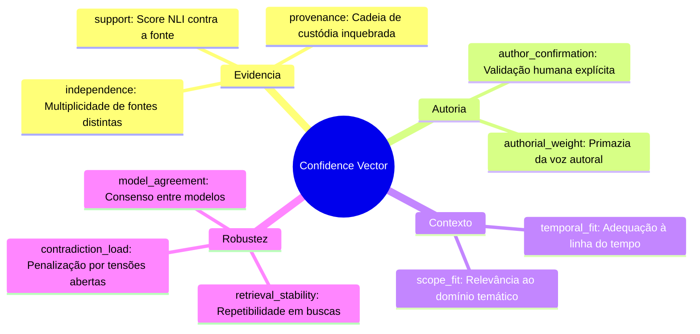
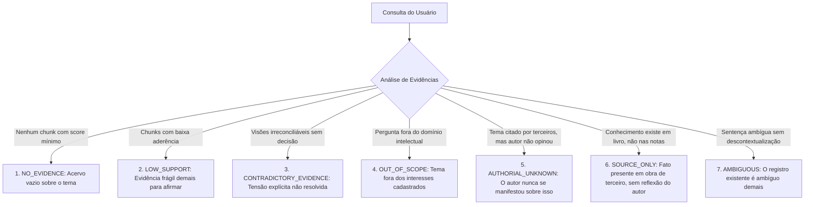

# MODELO DE CONFIDENCE VECTOR E ABSTENÇÃO — CÉREBRO REFLEX V3.1
### Desconstrução do Escalar Mágico, Vetor Multidimensional Calibrável e Taxonomia de Abstenção
**Missão:** MIS-0005 | **Status:** Normativo e Conceitual | **Data:** 2026-09-18

---

## 1. O Problema do "Escalar Mágico" em Sistemas de IA

Nos sistemas legados (incluindo o App 01), a certeza do modelo era comumente representada por um único número float (por exemplo, `confianca = 0.92`). 
Na prática de engenharia cognitiva, esse número único é uma ilusão perigosa:
- Ele esconde se a certeza decorre de uma citação direta do autor ou de mera fluência estatística do gerador;
- Não informa se o dado foi colhido ontem ou há 10 anos;
- Não indica se existem contradições no acervo;
- Trata fontes primárias e fontes secundárias de forma indiferenciada.

No **Cérebro Reflex V3.1**, a confiança é expressa como um **Vetor Multidimensional de 10 Componentes Calibráveis**.

---

## 2. As 10 Dimensões do Confidence Vector



### Detalhamento das 10 Dimensões:

| # | Dimensão | Intervalo | Descrição Operacional |
|---|---|:---:|---|
| **1** | `support` | $[0.0, 1.0]$ | Grau de sustentação do claim pelo texto original via modelo de NLI (Natural Language Inference). |
| **2** | `provenance` | $[0.0, 1.0]$ | Integridade da cadeia de custódia ($1.0$ se possui SHA-256 e offsets; $0.0$ se for fragmento sem origem). |
| **3** | `independence` | $[0.0, 1.0]$ | Quantidade de documentos e datas independentes que confirmam a mesma tese. |
| **4** | `author_confirmation` | $[0.0, 1.0]$ | $1.0$ se o autor clicou em aprovar; $0.5$ se foi aceito tacitamente; $0.0$ se for inferência não revisada. |
| **5** | `temporal_fit` | $[0.0, 1.0]$ | Relevância temporal da memória para a pergunta (decaimento de visões antigas se superadas). |
| **6** | `scope_fit` | $[0.0, 1.0]$ | Alinhamento do claim ao domínio da consulta (evita transportar regras de um domínio a outro). |
| **7** | `retrieval_stability` | $[0.0, 1.0]$ | Frequência com que o item emerge em diferentes formulações de busca (robustez a ruído de prompt). |
| **8** | `contradiction_load` | $[0.0, 1.0]$ | Penalidade proporcional ao número e gravidade de contradições não resolvidas vinculadas ao nó. |
| **9** | `model_agreement` | $[0.0, 1.0]$ | Consenso entre múltiplos avaliadores (ex: concordância entre Claude e GPT na interpretação). |
| **10**| `historical_utility` | $[0.0, 1.0]$ | Eficácia comprovada da memória em reflexões anteriores (taxa de não-rejeição pelo autor). |

---

## 3. Função de Agregação e Calibração por Tarefa

O vetor não é reduzido a uma média simples. A função de agregação pondera os componentes de acordo com a **intenção da tarefa**:

$$C_{\text{final}} = \sum_{i=1}^{10} w_i \cdot V_i - \lambda \cdot \text{contradiction\_load}$$

### Exemplos de Calibração de Pesos:
- **Para Resumo Factual:** Prioridade máxima para `support` ($w_1 = 0.40$) e `provenance` ($w_2 = 0.35$).
- **Para Síntese Autoral:** Prioridade máxima para `author_confirmation` ($w_4 = 0.45$) e `temporal_fit` ($w_5 = 0.25$).
- **Para Exploração Dialética:** `contradiction_load` não penaliza, mas é utilizado como critério de seleção para estimular o debate.

---

## 4. A Taxonomia das 7 Formas de Abstenção

> [!TIP]
> **ABSTENÇÃO É UM RESULTADO CORRETO E NOBRE:**  
> Declarar *"Você ainda não registrou nada sobre este tema em seu acervo"* é infinitamente superior a buscar 5 notas vagamente correlatas e gerar uma resposta enganosa.

O Cérebro Reflex V3.1 categoriza a abstenção em 7 modalidades explícitas:



### Formato Estruturado da Resposta de Abstenção:
Quando o sistema se abstém, ele retorna um objeto estruturado que a UI renderiza com elegância pedagógica:
```json
{
  "status": "abstained",
  "abstention_category": "AUTHORIAL_UNKNOWN",
  "mensagem_ao_usuario": "Você registrou a presença do livro 'Dialética do Esclarecimento' em sua biblioteca, mas ainda não produziu nenhuma anotação pessoal ou reflexão sobre este conceito.",
  "sugestoes_acao": [
    "Deseja registrar uma nota rápida sobre o que pensa a respeito?",
    "Deseja consultar o resumo puramente bibliográfico da obra?"
  ]
}
```
