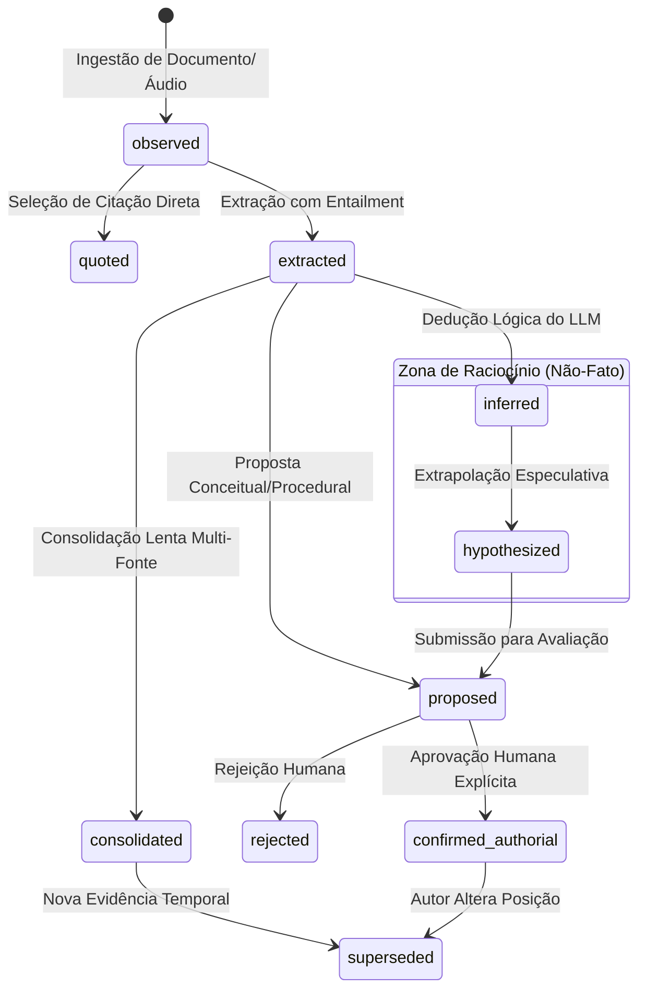

# MODELO EPISTEMOLÓGICO DO CÉREBRO REFLEX V3.1
### Fundamentação Teórica, Tipagem de Estados e Firewall de Memória
**Missão:** MIS-0005 | **Status:** Normativo e Conceitual | **Data:** 2026-09-18

---

## 1. A Pergunta Fundamental do Sistema

> **"Como impedir que o Reflex confunda algo que ele inferiu com algo que ele realmente lembra?"**

Em sistemas de IA convencionais baseados em RAG e agentes, há uma tendência estrutural à **amnésia epistêmica**: uma hipótese gerada por um modelo de linguagem em uma conversa passada é indexada em um banco vetorial; semanas depois, essa mesma hipótese é recuperada por outro agente e tratada como fato inquestionável sobre a vida ou o pensamento do autor.

No **App Reflex 02 V3.1**, essa confusão é tratada como uma **falha crítica de integridade cognitiva**. A inteligência do sistema não é medida pelo volume de texto ou pela eloquência persuasiva, mas pela sua capacidade inabalável de separar:
- O que foi **observado** diretamente na fonte;
- O que o autor **afirmou explicitamente**;
- O que foi **resumido** sinteticamente;
- O que o modelo **inferiu** dedutivamente;
- O que permanece como mera **hipótese especulativa**;
- O que foi expressamente **rejeitado** pelo autor;
- O que outrora era válido, mas foi **superado (superseded)** pelo tempo ou por novo pensamento.

---

## 2. A Hierarquia dos 10 Estados Epistemológicos

Cada unidade de informação que trafega ou reside no Cérebro Reflex V3.1 deve possuir um e apenas um `epistemic_status` ativo, governado por regras estritas de ciclo de vida:



### Matriz Normativa de Estados Epistemológicos

| Estado Epistemológico | Descrição Operacional | Quem Cria? | Quem Promove? | Onde Pode Aparecer? | Pode ser Usado como Evidência Factual? |
|---|---|---|---|---|:---:|
| **`observed`** | Dados brutos de ingestão (áudio, texto de PDF, notas). Imutável. | Extrator / Parser | Nenhum (base) | Source Memory, Storage | Sim (como fonte primária) |
| **`quoted`** | Trecho textual exato preservado com offset e span. | Extrator / Agente A3 | A5 (IA) | Chunks, Citações, Dossiê | Sim (comprovado) |
| **`extracted`** | Claim atômico extraído com entailment estrito comprovado. | Pipeline A5 / Extrator | Validador NLI | Claims Ledger, Dossiê | Sim (comprovado) |
| **`consolidated`** | Conhecimento validado por convergência de múltiplos episódios. | Worker de Consolidação | A5 / Supervisor | Memória Semântica | Sim (fato de longo prazo) |
| **`confirmed_authorial`**| Posicionamento, regra ou conceito explicitamente aprovado pelo autor. | Autor Humano | Autor Humano | Perfil Autoral, Dossiê | **Sim (máxima precedência)** |
| **`inferred`** | Dedução lógica derivada por LLM a partir de premissas. | LLM / Agentes | Worker de Replay | Working Memory, Dossiê | **Não (requer aviso de inferência)** |
| **`hypothesized`** | Especulação plausível, mas sem premissas completas no acervo. | LLM / Agente A8 | Humano ou Auditor | Seção de Hipóteses | **Não (apenas inspiração/pergunta)** |
| **`proposed`** | Conceito ou regra formulada pela IA aguardando decisão humana. | Pipeline Cognitivo | Humano | Fila de Aprovação | **Não (em observação)** |
| **`rejected`** | Afirmação, conceito ou regra refutada formalmente pelo autor. | Autor Humano | Autor Humano | Histórico de Rejeições | **Não (serve como contra-regra)** |
| **`superseded`** | Informação que foi válida no passado, mas foi refinada ou revogada. | Sistema ou Autor | Sistema ou Autor | Histórico Epistêmico | Não para presente (sim para histórico) |

---

## 3. As 6 Dimensões da Personalização e Memória Autoral

Para evitar o sobreajuste e a simplificação psicológica, o sistema nunca rotula o usuário de forma genérica ("Você é uma pessoa criativa e ansiosa"). A personalização é decomposta em 6 dimensões estanques:

```
                      ┌────────────────────────────────────────┐
                      │        ARQUITETURA DA IDENTIDADE       │
                      └──────────────────┬─────────────────────┘
         ┌──────────────────┬────────────┴───────────┬──────────────────┐
         ▼                  ▼                        ▼                  ▼
   1. PENSAMENTO      2. MÉTODO               3. EPISTEMOLOGIA     4. ESTILO
(Conceitos nucleares  (Processos intelectuais  (Critérios de verdade (Voz, ritmo, tom
e teses autorais)     e rituais de trabalho)    e rigor analítico)     e vocabulário)
         │                                                              │
         └──────────────────────────┬───────────────────────────────────┘
                                    ▼
                         ┌───────────────────────┐
                         │ 5. PREFERÊNCIA        │ (Decisões contextuais momentâneas)
                         │ 6. POSIÇÃO HISTÓRICA  │ (Opiniões situadas no tempo)
                         └───────────────────────┘
```

1. **Pensamento:** Teses substantivas defendidas pelo autor (ex: "A técnica sem reflexão produz alienação").
2. **Método:** Heurísticas de trabalho (ex: "Sempre produzir um fichamento preliminar antes de redigir o ensaio").
3. **Epistemologia:** O que o autor aceita como prova (ex: "Rejeita evidências anedóticas em ensaios teóricos").
4. **Estilo:** Cadência, vocabulário ativo, pontuação, uso de primeira pessoa, rejeição de clichês motivacionais.
5. **Preferência:** Escolhas situacionais (ex: "Prefere resumos em tópicos para reuniões rápidas").
6. **Posição Histórica:** Opinião política, estética ou acadêmica expressa em uma data específica, sujeita a evolução.

---

## 4. O Firewall de Memória vs. Inferência (`MEMORY_INFERENCE_FIREWALL`)

Nenhuma inferência do modelo pode ser promovida a memória ou expressa como certeza autoral sem cruzar três barreiras estruturais:

1. **Barreira Sintática de Atribuição:**
   - É terminantemente proibido gerar frases afirmativas de crença ("Você acha...", "Você prefere...", "Você sempre defendeu...") a menos que haja um claim com status `confirmed_authorial` ou `extracted` de citação explícita.
   - Caso o suporte seja derivado de inferência, o modelo é obrigado a usar prefixos epistêmicos calibrados:
     > *"Com base em suas notas de 2024 sobre o tema X, é possível inferir que..."*  
     > *"Uma hipótese a ser confirmada por você é..."*
2. **Barreira de Isolamento de Persistência:**
   - Inferências geradas durante uma reflexão nunca são gravadas nas tabelas de memória factual episódica ou semântica. Elas permanecem no escopo da reflexão específica até que o autor confirme a ideia.
3. **Barreira de Proveniência em Ciclo Fechado:**
   - Toda resposta gerada passa pelo **Auditor Cognitivo**, que desmonta as frases em claims e verifica se algum claim com status `inferred` ou `hypothesized` foi disfarçado de memória recuperada. Se for detectada contaminação, a resposta é rejeitada e reescrita.
