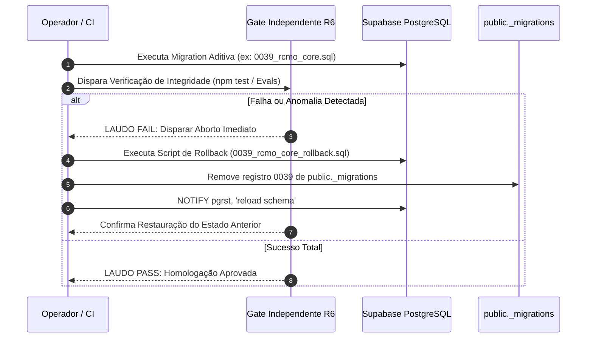

# PLANO DE EXPAND-FIRST E ROLLBACK DE BANCO DE DADOS
### Diretrizes Normativas para Evolução Segura do Schema PostgreSQL sem Indisponibilidade ou Perda de Dados
**Missão:** `TP-RCMO-02-LEGACY-RECONCILIATION` (`TP-RCMO-02`)  
**Responsáveis:** R3 (Data & Supabase), R2 (Architecture), R6 (QA & Security)  
**Baseline Live:** Supabase live (`xenapowdtfhdwcfthfrn`) — Ledger `public._migrations`: 38  
**Status:** Normativo e Canônico | **Data:** 20 de setembro de 2026  

---

## 1. AS CINCO LEIS DA ESTRATÉGIA EXPAND-FIRST NO REFLEX 02

Qualquer migration futura que venha a implementar contratos do **Modelo Canônico de Entidades Cognitivas RCMO V1** deverá obedecer irrestritamente às **Cinco Leis da Estratégia Expand-First**:

```
┌────────────────────────────────────────────────────────────────────────┐
│                   AS CINCO LEIS DO EXPAND-FIRST                        │
├────────────────────────────────┬───────────────────────────────────────┤
│ 1. LEI DA ADITIVIDADE PURA     │ Proibido DROP TABLE, DROP COLUMN ou   │
│                                │ restrições destrutivas de tipo.       │
├────────────────────────────────┼───────────────────────────────────────┤
│ 2. LEI DA OPCIONALIDADE INICIAL│ Novas colunas nascem NULLABLE ou com  │
│                                │ DEFAULT determinístico antes de       │
│                                │ qualquer constraint NOT NULL.         │
├────────────────────────────────┼───────────────────────────────────────┤
│ 3. LEI DAS VIEWS DE FACHADA    │ Criar views de compatibilidade para   │
│                                │ proteger queries ativas em src/**.    │
├────────────────────────────────┼───────────────────────────────────────┤
│ 4. LEI DO DUAL-WRITE TRANSITÓRIO│ Operar suporte híbrido antes de       │
│                                │ desativar qualquer leitura legada.    │
├────────────────────────────────┼───────────────────────────────────────┤
│ 5. LEI DO ROLLBACK TESTÁVEL    │ Toda migration deve possuir script de │
│                                │ reversão reversível e idempotente.    │
└────────────────────────────────┴───────────────────────────────────────┘
```

---

### Lei 1: Aditividade Pura
* É terminantemente vedada a execução de comandos `DROP TABLE`, `DROP COLUMN` ou `ALTER TABLE ... DROP CONSTRAINT` que retirem garantias de integridade já ativas.
* Se uma entidade for superada (ex: `processamento.sinteses`), ela é preservada em modo de leitura para auditoria e suas novas instâncias são direcionadas para a nova tabela (`cerebro_autoral.rcmo`).

### Lei 2: Opcionalidade Inicial e Backfill em Três Fases
Quando uma nova coluna obrigatória for introduzida em tabela existente (ex: `offset_unit` em `claim_provenance`):
1. **Fase Expand (Adição Opcional):** A coluna é criada como `NULLABLE` (ou com `DEFAULT 'unicode_code_point'`).
2. **Fase Backfill (Povoamento Determinístico):** Um script idempotente preenche os registros existentes sem travar locks prolongados no PostgreSQL.
3. **Fase Contract (Endurecimento):** Somente após 100% das linhas estarem validadas e o código de produto atualizado é que se adiciona a constraint `ALTER TABLE ... ALTER COLUMN ... SET NOT NULL`.

### Lei 3: Views de Compatibilidade e Fachadas
* Se a estrutura subjacente de dados for normalizada (ex: decomposição de `claim_provenance` em `evidence_anchors` e `evidence_annotations`), cria-se uma `VIEW` com o nome da tabela antiga utilizando `security_invoker = true`.
* Isso impede que componentes do Next.js ou queries existentes quebrem em tempo de execução durante o período de transição.

### Lei 4: Convivência e Deprecação Graciosa
* Nenhuma rota de API ou serviço de domínio é desligado abruptamente.
* Define-se um período formal de quarentena documental antes de qualquer arquivamento de superfícies antigas.

### Lei 5: Script de Rollback Obrigatório
* Nenhuma migration é aprovada para execução em homologação ou produção sem a entrega prévia do seu respectivo script de reversão (`_rollback.sql` ou função de teardown idempotente).

---

## 2. PROCEDIMENTO OPERACIONAL DE ROLLBACK

Caso uma migration futura gere anomalias de performance, contenha inconsistências de tipos ou seja reprovada no gate independente R6:



### 2.1. Template Padrão de Rollback Idempotente

Todo script de reversão deve seguir a estrutura defensiva:

```sql
-- ==============================================================================
-- ROLLBACK DA MIGRATION: 00XX_nome_da_migracao.sql
-- ==============================================================================

BEGIN;

-- 1. Reverter permissões e RLS concedidos
DROP POLICY IF EXISTS "..." ON ...;

-- 2. Remover views de compatibilidade adicionadas
DROP VIEW IF EXISTS ...;

-- 3. Remover tabelas novas criadas (somente tabelas novas sem dados legados)
DROP TABLE IF EXISTS ... CASCADE;

-- 4. Remover colunas aditivas adicionadas em tabelas existentes
ALTER TABLE ... DROP COLUMN IF EXISTS ...;

-- 5. Atualizar o ledger da aplicação public._migrations
DELETE FROM public._migrations WHERE versao = '00XX_nome_da_migracao.sql';

-- 6. Recarregar o cache do PostgREST
NOTIFY pgrst, 'reload schema';

COMMIT;
```

---

## 3. TRIGGERS DE ABORTO IMEDIATO (EMERGENCY ABORT)

A execução de qualquer migration futura deve ser abortada e revertida imediatamente caso ocorra:

1. **Quebra de Invariante de Autoria:** Qualquer escrita direta que crie características ou regras com estado `confirmada` sem evento humano correspondente.
2. **Violação de RLS / Tenant Isolation:** Falha nos testes de isolamento de tenant em `tests/seguranca/supabase-isolamento-rls.test.ts`.
3. **Lock Timeout em Tabelas Críticas:** Migrations que ultrapassem 5 segundos de lock exclusivo em `biblioteca.obras` ou `processamento.fragmentos`.
4. **Drift no Ledger do App:** Divergência na contagem sequencial de `public._migrations`.

---

## 4. GOVERNANÇA E PORTÃO DE AUTORIZAÇÃO

* **Risco da Operação:** HIGH.
* **Aprovação Obrigatória:** Nenhuma migration SQL pode ser aplicada no banco de dados live do Supabase (`xenapowdtfhdwcfthfrn`) sem:
  1. Revisão de código completa pelo **Antigravity 2.0 (R3/R6)**;
  2. Parecer independente favorável do **ChatGPT/Codex** e **Claude Code Cloud**;
  3. Autorização explícita e soberana do **Usuário**.
