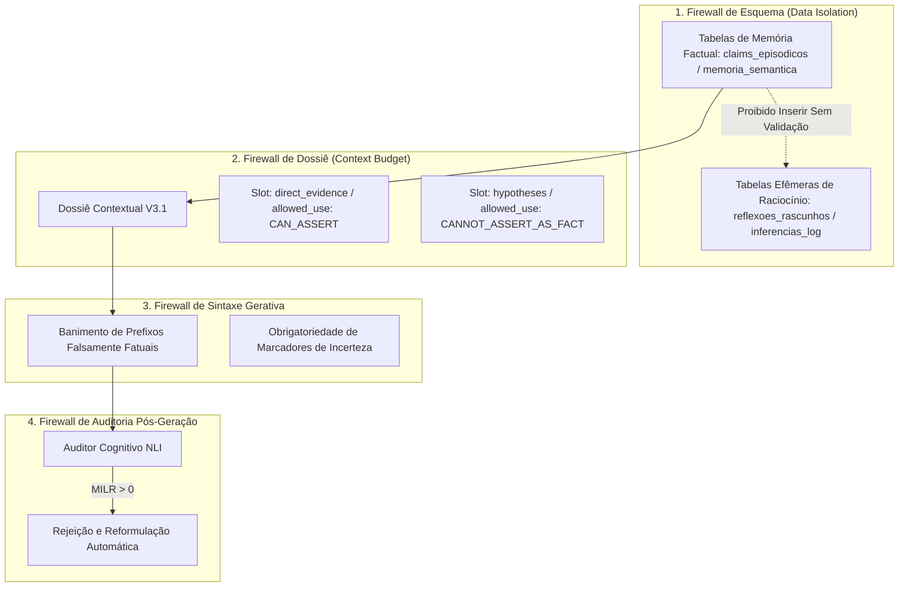

# POLÍTICA MEMORY-INFERENCE FIREWALL — CÉREBRO REFLEX V3.1
### A Barreira Estrutural contra a Contaminação Epistêmica entre Inferência e Memória
**Missão:** MIS-0005 | **Status:** Normativo | **Data:** 2026-09-18

---

## 1. A Regra Central Inviolável

> [!CAUTION]
> **REGRA CENTRAL DE INTEGRIDADE COGNITIVA:**  
> **Uma inferência do LLM NUNCA pode ser posteriormente recuperada e apresentada como MEMÓRIA sem transformação epistemológica explícita e autorizada.**

Quando um LLM deduz que "o autor provavelmente prefere trabalhar à noite" porque três anotações foram registradas após as 22h, essa conclusão é uma **inferência estatística circunstancial** (`inferred`), jamais uma **memória factual** (`confirmed_authorial`). Se o sistema em uma sessão subsequente disser *"Lembro que você prefere trabalhar à noite"*, o firewall foi violado.

O **Memory-Inference Firewall** é o conjunto de mecanismos arquiteturais que impede fisicamente esse vazamento de estado.

---

## 2. A Métrica Primária: Memory-Inference Leakage Rate (MILR)

Para governar e auditar esse comportamento, o Reflex V3.1 institui o **MILR** como métrica primária de qualidade epistemológica:

$$MILR = \frac{\sum \text{Claims apresentados com autoridade de memória cuja origem era apenas inferência}}{\sum \text{Total de Claims apresentados como memória}} \times 100\%$$

- **Meta Aspiracional:** $\mathbf{MILR = 0.0\%}$.
- **Limiar de Bloqueio em Produção:** Qualquer versão de prompt, modelo ou pipeline que resulte em $MILR > 0.5\%$ nos testes de benchmark é sumariamente bloqueada no Quality Gate de CI/CD.

---

## 3. As Quatro Camadas do Firewall

### Camada 1: Isolamento Físico de Esquema
- Inferências, sugestões e especulações de agentes são salvas em esquemas temporários ou colunas com tipagem restrita (`epistemic_status = 'inferred'`).
- Apenas eventos validados pelo pipeline NLI ou aprovados explicitamente pelo autor podem ter status `consolidated` ou `confirmed_authorial`.

### Camada 2: Políticas de Uso no Dossiê (`Allowed Use`)
Cada fragmento de conhecimento injetado no prompt do LLM carrega regras estritas de utilização operacional:
- `CAN_BE_STATED_AS_FACT`: Exclusivo para `observed`, `quoted`, `extracted` e `confirmed_authorial`.
- `CAN_INSPIRE_QUESTION`: Para `hypothesized`.
- `CAN_BE_MENTIONED_AS_POSSIBLE_DEDUCTION`: Para `inferred` (sempre exigindo condicionais como *"é plausível que"*, *"os dados sugerem"*).
- `CANNOT_BE_PRESENTED_AS_MEMORY`: Proíbe expressamente o uso de verbos de rememoração pelo assistente.

### Camada 3: Controle Estrito de Prefixos Autorais
São terminantemente banidas da geração as seguintes construções quando desprovidas de âncora `confirmed_authorial`:
- ❌ *"Você acredita que..."*
- ❌ *"Como você bem sabe, sua posição é..."*
- ❌ *"Você prefere..."*
- ❌ *"Lembro-me de que você decidiu..."*
- ❌ *"Você costuma..."*

Formas permitidas sob inferência:
-  *"Em seus apontamentos de maio de 2024 sobre o tema, nota-se uma ênfase em..."*
-  *"Uma leitura possível dessas duas passagens seria... Faz sentido para o seu momento atual?"*

### Camada 4: Auditoria Pós-Geração com Reescrita
Antes de o texto final ser renderizado na interface ou persistido na reflexão, o pipeline de pós-geração extrai todos os claims produzidos e verifica a correspondência com os metadados do Dossiê. Se um claim assertivo derivar de uma premissa inferida, o auditor aciona a reformulação corretiva.
