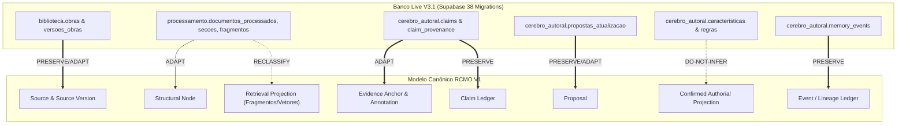

# RECONCILIAÇÃO DETALHADA DO LEGADO V3.1 → MODELO CANÔNICO RCMO V1
### Matriz de Compatibilidade Coluna a Coluna, Tipagem e Estratégia de Transição
**Missão:** `TP-RCMO-02-LEGACY-RECONCILIATION` (`TP-RCMO-02`)  
**Responsáveis:** R2 (Architecture), R3 (Data & Supabase), R5 (Cognitive)  
**Baseline Live:** `e4d40766a9d386b6bdabc50d9c43ab45dfcae15f` (`main`)  
**Banco de Dados Auditado:** Supabase live (`xenapowdtfhdwcfthfrn`) — Ledger `public._migrations`: 38  
**Regra Fundamental:** Este documento é uma especificação de engenharia. **Zero comandos DDL são executados em banco live.**  

---

## 1. PRINCÍPIOS METODOLÓGICOS DE RECONCILIAÇÃO

Para transpor o estado real do banco de dados live para o **Modelo Canônico de Entidades Cognitivas V1** ([`RCMO_CANONICAL_ENTITY_MODEL_V1.md`](file:///E:/APP/Reflex%2002/reflex02/docs/ia/RCMO_CANONICAL_ENTITY_MODEL_V1.md)) sem riscos de indisponibilidade ou quebra de consultas em produção, adota-se uma taxonomia rigorosa de classificação de superfícies:

1. **`PRESERVE`:** A tabela ou coluna já atende integralmente à semântica canônica e permanece intocada.
2. **`ADAPT`:** A semântica é compatível, mas o contrato requer uma view de compatibilidade ou a adição de colunas aditivas no futuro.
3. **`RECLASSIFY`:** Os dados continuam íntegros e úteis, porém deixam de ser tratados como fontes de autoridade e passam a ser classificados formalmente como *Projeções de Retrieval* ou *Projeções Operacionais*.
4. **`BACKFILL-LATER`:** Campos novos essenciais (ex: `offset_unit`, `normalization_profile`) que só poderão ser preenchidos quando houver reprocessamento determinístico com prova matemática.
5. **`DO-NOT-INFER`:** Proibição estrutural estrita: dados históricos sem prova auditável de clique humano (ex: regras antigas gravadas com `ativa=true`) **jamais** serão retroativamente marcados como "confirmados pelo autor".

---

## 2. RECONCILIAÇÃO DETALHADA POR CAMADA DE DOMÍNIO

---

### 2.1. Camada de Origem: `biblioteca.obras` e `biblioteca.versoes_obras`

Mapeamento da custódia física da obra original.

#### A. `biblioteca.obras` $\to$ Entidade `Source`

| Coluna SQL Live | Tipo SQL | Mapeamento Canônico | Classe | Tratamento de Compatibilidade |
| :--- | :--- | :--- | :---: | :--- |
| `id` | `uuid` | `Source.source_id` | `PRESERVE` | Preserva identidade física exata. |
| `usuario_id` | `uuid` | `Source.tenant_id` | `ADAPT` | Mapeia o usuário autenticado como o proprietário/tenant. |
| `titulo` | `text` | `Source.title` | `PRESERVE` | Título original da obra. |
| `natureza` | `text` | `Source.source_kind` | `ADAPT` | Mapeamento determinístico: `'autoral' \to 'author_work'`, `'externa' \to 'external_work'`. |
| `papel_fonte` | `text` | `Source.source_role` | `ADAPT` | Preserva enum V3.1 (`AUTHOR_EXPLICIT`, `EXTERNAL_SOURCE`). |
| `status` | `text` | Metadados operacionais | `PRESERVE` | Status do ciclo de vida no app (`rascunho`, `processada`, etc.). |
| `metadados` | `jsonb` | `Source.metadata` | `PRESERVE` | Armazena metadados flexíveis de custódia. |
| `criado_em` | `timestamptz`| `Source.created_at` | `PRESERVE` | Timestamp imutável de criação. |

#### B. `biblioteca.versoes_obras` $\to$ Entidade `Source Version`

| Coluna SQL Live | Tipo SQL | Mapeamento Canônico | Classe | Tratamento de Compatibilidade |
| :--- | :--- | :--- | :---: | :--- |
| `id` | `uuid` | `SourceVersion.source_version_id` | `PRESERVE` | Identificador único da versão. |
| `obra_id` | `uuid` | `SourceVersion.source_id` | `PRESERVE` | Chave estrangeira para a Source. |
| `numero_versao` | `integer`| `SourceVersion.version_number` | `PRESERVE` | Versão sequencial ($1, 2, \dots$). |
| `hash_sha256` | `text` | `SourceVersion.content_hash` | `PRESERVE` | Hash de integridade criptográfica SHA-256. |
| `mime_type` | `text` | `SourceVersion.mime_type` | `PRESERVE` | Tipo MIME do arquivo físico. |
| `tamanho_bytes`| `bigint` | `SourceVersion.size_bytes` | `PRESERVE` | Tamanho do arquivo bruto. |
| *[Ausente no live]* | — | `SourceVersion.normalization_profile` | `BACKFILL-LATER` | **Gap Identificado pela Pesquisa R8:** O legado não registra o perfil de normalização. Futuras ingestões devem persistir `"NFC"`. Linhas históricas receberão `"UNKNOWN_LEGACY"`. |

---

### 2.2. Camada Estrutural: `processamento.secoes` e Projeções

#### A. `processamento.secoes` $\to$ Entidade `Structural Node`

| Coluna SQL Live | Tipo SQL | Mapeamento Canônico | Classe | Tratamento de Compatibilidade |
| :--- | :--- | :--- | :---: | :--- |
| `id` | `uuid` | `StructuralNode.structural_node_id` | `PRESERVE` | Identidade do nó estrutural. |
| `documento_processado_id`| `uuid` | Resolução de versão | `ADAPT` | Resolve para `source_version_id` via `documentos_processados.versao_obra_id`. |
| `secao_pai_id` | `uuid` | `StructuralNode.parent_node_id` | `PRESERVE` | Árvore hierárquica recursiva. |
| `nivel` | `integer`| Hierarquia estrutural | `PRESERVE` | Profundidade na árvore documental. |
| `ordem` | `integer`| `StructuralNode.ordinal` | `PRESERVE` | Posição sequencial na leitura. |
| `titulo` | `text` | `StructuralNode.label` | `PRESERVE` | Rótulo do capítulo ou seção. |
| `tipo_secao` | `text` | `StructuralNode.node_type` | `ADAPT` | Mapeia `'capitulo'`, `'secao'`, `'paragrafo'` para enums canônicos. |
| *[Ausente no live]* | — | `StructuralNode.structural_path` | `BACKFILL-LATER` | Array de títulos da raiz até o nó (pode ser calculado via CTE recursiva). |

#### B. `processamento.fragmentos` e `vetores` $\to$ `Retrieval Projection` (`RECLASSIFY`)

* **Classificação Formal:** `RECLASSIFY`.
* **Fundamento Epistêmico:** Chunks textuais (1.000 a 1.500 caracteres) e embeddings densos (`vector(1536)`) são **artefatos efêmeros de recuperação**, recalculáveis a qualquer momento.
* **Invariante:** Fragmentos e vetores **não possuem autoridade de evidência primária**. Se o extrator de chunking for aprimorado, nenhum claim ou âncora canônica é destruído.

---

### 2.3. Camada de Evidência e Claims: `cerebro_autoral.claim_provenance` e `claims`

#### A. `cerebro_autoral.claim_provenance` $\to$ `Evidence Anchor` + `Annotation`

O legado armazenava proveniência atômica em tabela intermediária. O modelo canônico decompõe esse registro em **Onde está a evidência** (`Evidence Anchor`) e **Qual a relação lógica com o Claim** (`Annotation`).

| Coluna SQL Live | Tipo SQL | Mapeamento Canônico | Classe | Tratamento de Compatibilidade e Recomendações R8 |
| :--- | :--- | :--- | :---: | :--- |
| `id` | `uuid` | `evidence_anchor_id` / `annotation_id` | `ADAPT` | Pode servir de chave na transição. |
| `claim_id` | `uuid` | `Annotation.body_ref` | `PRESERVE` | Aponta para a proposição associada (`entity_type: 'claim'`). |
| `fragmento_id`| `uuid` | Localizador auxiliar | `RECLASSIFY` | Passa a ser metadado de conveniência de busca; âncora canônica resolve contra Source Version. |
| `span_texto_original` | `text` | `EvidenceAnchor.exact_quote` | `PRESERVE` | Citação literal idêntica. |
| `span_start` | `integer`| `EvidenceAnchor.start` | `ADAPT` | Requer declaração explícita de `offset_unit`. |
| `span_end` | `integer`| `EvidenceAnchor.end` | `ADAPT` | Requer declaração explícita de `offset_unit`. |
| `content_hash` | `text` | `EvidenceAnchor.content_hash`| `PRESERVE` | Hash de verificação do trecho citado. |
| *[Ausente]* | — | `EvidenceAnchor.offset_unit` | `BACKFILL-LATER` | **Diretriz R8:** Atribuir `'unicode_code_point'` para novas âncoras; legado rotulado como `'unknown_legacy'`. |
| *[Ausente]* | — | `EvidenceAnchor.normalization` | `BACKFILL-LATER` | **Diretriz R8:** Normalização `'NFC'` obrigatória nas novas ingestões. |
| *[Ausente]* | — | `Annotation.relation` | `ADAPT` | Atribuir default `'support'` para proveniências históricas do legado V3.1. |

#### B. `cerebro_autoral.claims` $\to$ Entidade `Claim`

A tabela de claims já foi concebida sob o rigor da V3.1 (Migration `0031_claims_ledger.sql`). Seus enums e sua máquina de estados são **canônicos e soberanos**.

| Coluna SQL Live | Tipo SQL | Mapeamento Canônico | Classe | Conformidade com RCMO V1 |
| :--- | :--- | :--- | :---: | :--- |
| `id` | `uuid` | `Claim.claim_id` | `PRESERVE` | Identidade única. |
| `usuario_id` | `uuid` | `Claim.tenant_id` | `PRESERVE` | Isolamento estrito por tenant. |
| `proposicao` | `text` | `Claim.statement` | `PRESERVE` | Enunciado atômico descontextualizado. |
| `tipo_claim` | `enum` | `Claim.claim_type` | `PRESERVE` | `SOURCE_CLAIM`, `AUTHOR_EXPLICIT_CLAIM`, `INFERRED_CLAIM`, etc. |
| `estado_epistemologico` | `enum` | `Claim.epistemic_status` | `PRESERVE` | Os 10 estados (`observed` até `superseded`). |
| `papel_fonte` | `enum` | `Claim.source_role` | `PRESERVE` | `AUTHOR_EXPLICIT`, `EXTERNAL_SOURCE`, `SYSTEM_INFERENCE`, etc. |
| `verificabilidade` | `enum` | `Claim.verifiability` | `PRESERVE` | `VERIFIABLE`, `UNVERIFIABLE`, `AMBIGUOUS`. |
| `confianca_nli`| `numeric` | `Claim.nli_confidence` | `PRESERVE` | Confiança do validador de entailment. |
| `vetor_confianca`| `jsonb` | `Claim.confidence` | `PRESERVE` | O vetor de 10 componentes calibráveis. |

---

### 2.4. Camada do Cérebro Autoral: Propostas, Características e Regras

#### A. `cerebro_autoral.propostas_atualizacao` $\to$ Entidade `Proposal`

* **Classificação:** `PRESERVE` / `ADAPT`.
* **Campos Live:** `id`, `usuario_id`, `dimensao_id`, `tipo_proposta` (`caracteristica`, `regra`, `conceito`), `conteudo_proposto` (`jsonb`), `estado_decisao` (`pendente`, `aceita`, `rejeitada`, `editada`).
* **Invariante Canônica:** `estado_decisao = 'aceita'` **não materializa automaticamente uma projeção autoral confirmada**. A aprovação da proposta apenas autoriza o pipeline a criar a `Confirmed Authorial Projection` correspondente vinculada ao `decision_event_id` da ação humana.

#### B. `cerebro_autoral.caracteristicas` e `regras` $\to$ `Confirmed Authorial Projection`

* **Classificação:** `DO-NOT-INFER` / `ADAPT`.
* **Regra de Ouro Histórica:**
  O banco live contém características e regras legadas geradas nas primeiras versões experimentais (MIS-0001 a MIS-0003), com colunas como `confianca_calculada: 0.92` e `estado_revisao: 'confirmada'` gravadas hardcoded.
* **Decisão Normativa:**
  Nenhuma dessas linhas legadas será promovida à entidade canônica `Confirmed Authorial Projection` a menos que exista um registro histórico comprovável de aprovação deliberada pelo Usuário no ledger `memory_events`. Linhas sem comprovação permanecem como legado em quarentena (`legacy_unverified`).

---

### 2.5. Event Ledger e Governança: `cerebro_autoral.memory_events`

* **Classificação:** `PRESERVE`.
* **Tabela Live:** `cerebro_autoral.memory_events` (estruturada nas migrations `0032_episodic_event_ledger.sql` e `0033_event_ledger_hardening.sql`).
* **Papel no RCMO:** Funciona como a espinha dorsal de causalidade e auditoria transversal do sistema. Registra `actor_type` (`HUMAN`, `SYSTEM_WORKER`, `COGNITIVE_AGENT`), `causation_event_id`, `idempotency_key` e `payload_hash`.
* **Invariante:** Não se cria nenhum ledger paralelo. Todas as decisões humanas de RCMO, Proposals e Projeções Autorais geram eventos nesta tabela.

---

## 3. RECONCILIAÇÃO DOS DOIS LEDGERS DE BANCO DE DADOS

O App Reflex 02 possui duas trilhas de controle de migração que devem ser formalmente distinguidas:

| Ledger de Controle | Schema / Tabela | Entradas | Papel Operacional | Regra de Governança |
| :--- | :--- | :---: | :--- | :--- |
| **Ledger da Aplicação** | `public._migrations` | 38 | Registra as migrations SQL controladas pelo repositório (de `0001` a `0038`). | **Canônico do Projeto.** Toda nova migration de produto adiciona uma linha numerada sequencialmente neste ledger. |
| **Histórico da Plataforma** | `supabase_migrations.schema_migrations` | Sistema | Histórico interno de versionamento do Supabase CLI / dashboard. | **Operacional da Nuvem.** Mantido para reconciliação de infraestrutura, sem ser alterado diretamente pelo código da aplicação. |

---

## 4. CONCLUSÃO TÉCNICA DO TP-RCMO-02

1. **Zero Mutações Live:** As 38 migrations existentes permanecem íntegras no banco `xenapowdtfhdwcfthfrn`.
2. **Compatibilidade Total:** Nenhuma tabela existente precisa ser excluída. Todas as transições futuras para o modelo RCMO V1 ocorrerão de forma estritamente aditiva (*expand-first*).
3. **Imunidade Autoral:** Fica assegurado que dados legados não validados não contaminarão a voz autoral do Cérebro Reflex.
