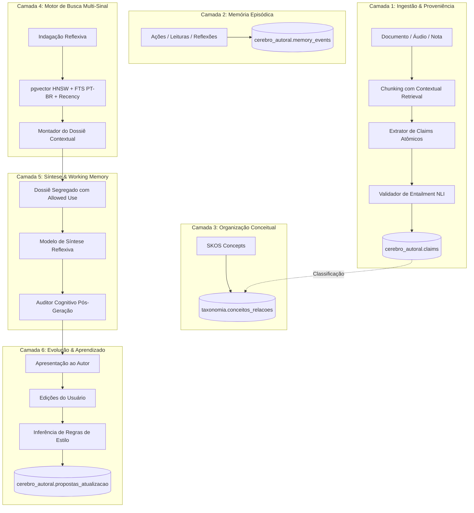
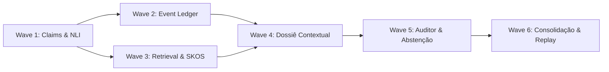

# Plano Mestre de Modernização Cognitiva V3.1 — App Reflex 02

**Documento:** PLANO_MESTRE_MODERNIZACAO_COGNITIVA_V3_1.md  
**Missão de Origem:** MIS-0006 (Fechamento da Pesquisa, Design Freeze e Plano Mestre)  
**Data de Aprovação:** 18 de setembro de 2026  
**Status:** `DOCUMENTO NORMATIVO HOMOLOGADO / GUIA VINCULANTE DE EXECUÇÃO`  
**Autores & Guardiões:** A1 (Coordenação & Arquitetura), A4 (Backend & Supabase), A5 (IA & Conhecimento), A6 (Plataforma & CI), A7 (QA & AppSec), A8 (Pesquisa & Avaliação), A9 (Continuidade & Evidências)  
**Referências Vinculadas:** `docs/ia/DECISION_MATRIX_FINAL_V3_1.md`, `docs/ia/DESIGN_FREEZE_COGNITIVO_V3_1.md`, ADR 0002, ADR 0003  

---

## 1. Sumário Executivo e Objetivos Estratégicos

O App Reflex 02 é um ecossistema autoral reflexivo focado na preservação, ampliação e interlocução profunda com a mente e a obra de seu autor. Após os sucessos operacionais das missões MIS-0000 à MIS-0005 e a homologação do **Agent Harness V2**, o projeto concluiu a fase exploratória e de fundamentação teórica.

Este **Plano Mestre de Modernização Cognitiva V3.1** estabelece a ponte executável definitiva entre a arquitetura conceitual e o código de produção. O objetivo estratégico é substituir a recuperação baseada em chunks soltos e a síntese probabilística desancorada por um **Cérebro Epistêmico Estruturado**, composto por Claims atômicos, proveniência auditável via hashing criptográfico, isolamento por Memory-Inference Firewall e recuperação híbrida multi-sinal em PostgreSQL 17 / pgvector.

A modernização é decomposta em **6 Waves progressivas, isoladas e testáveis**, sem quebras de compatibilidade em produção, com adoção rigorosa de *Shadow Mode*, migrações aditivas seguras e validação formal em CI através do Golden Dataset de 12 famílias de raciocínio.

---

## 2. Princípios Norteadores e Invariants Congelados

Todo o desenvolvimento das Waves deve aderir estritamente aos 14 Invariants Cognitivos formalizados no `docs/ia/DESIGN_FREEZE_COGNITIVO_V3_1.md`:
1. **Soberania Autoral Inviolável:** O autor é a verdade primordial;
2. **Segregação Absoluta (Memory-Inference Firewall):** Fatos e inferências não se misturam;
3. **Proveniência de Claims:** Vínculo de span imutável com a fonte primária;
4. **Regra de Ouro:** *Ambiguidade $\to$ Não Extrai*;
5. **Zero Mutação Silenciosa:** Crenças centrais não mudam sem validação humana;
6. **Primazia da Abstenção Honesta:** Dizer "não sei" em vez de alucinar;
7. **Dossiê Contextual Segregado:** Blocos com `Allowed Use` explícito;
8. **Validação Estruturada Zod:** Toda saída de LLM é tipada em tempo de execução;
9. **Isolamento Criptográfico via RLS:** Toda query respeita a identidade do usuário;
10. **Zero Simulação na Telemetria:** Métricas baseadas exclusivamente em execuções reais;
11. **Recuperação Híbrida Multi-Sinal:** Vetorial + Full Text Search PT-BR + Recência + Epistemologia;
12. **Taxonomia SKOS W3C:** Relações conceituais padronizadas e determinísticas;
13. **Golden Dataset como Release Gate:** 100% de aprovação nas 12 famílias CBR;
14. **Rastreabilidade Tripartite (Harness V2):** Evidências confirmadas registradas por A9.

---

## 3. Diagnóstico e Baseline Atual da Engenharia

No fechamento da MIS-0006, o repositório apresenta o seguinte estado canônico:
- **Repositório Git:** `villacanabrava-maker/App-Reflex-02` sincronizado na branch `main` com 80 testes Vitest (21 arquivos) passando com 100% de sucesso.
- **Banco de Dados Supabase (`xenapowdtfhdwcfthfrn`):** 30 migrations aplicadas com paridade total, RLS ativo em todos os schemas (`public`, `taxonomia`, `cerebro_autoral`, `sistema`), storage configurado para 50MB no bucket privado `originais-biblioteca`.
- **Harness Multiagente V2:** 9 agentes especializados (A1 como único orquestrador `mainAgent`, A2 a A9 como subagentes puros), com políticas de comando seguras e contratos de Task Packets tipados.
- **Segurança (INC-SEC-20260918-01):** Classificado como `P0 ABERTO — CREDENCIAL REVOGAÇÃO PENDENTE` aguardando rotação da senha de banco pelo console web Supabase.
- **Hospedagem / Vercel:** Totalmente fora de escopo por determinação da governança.

---

## 4. Arquitetura Alvo V3.1 (Visão Holística)

A Arquitetura Cognitiva V3.1 transforma o fluxo de dados em um pipeline de 6 camadas integradas em PostgreSQL 17:

---

## 5. Metodologia de Implementação: O Modelo de 6 Waves Progressivas

Para garantir integridade, cada Wave é concebida como uma missão autônoma (`MIS-0007` a `MIS-0012`), executada sequencialmente sob o ciclo:
1. **Especificação Normativa:** Definição prévia do schema, testes e contratos;
2. **Implementação Isolada em Shadow Mode:** Sem afetar a experiência atual do usuário;
3. **Auditoria Independente por A7:** Execução de testes de estresse, segurança e evals;
4. **Handoff e Reconciliação Tripartite por A9:** Emissão do relatório formal AG-XXXX;
5. **Quality Gates & Merge na Main:** Validação completa no GitHub Actions CI.

---

## 6. Wave 1: Fundação de Claims, NLI e Golden Dataset (MIS-0007)
- **Objetivo:** Criar a infraestrutura de Claims Ledger, extrator determinístico, validador de Entailment NLI (*Ambiguidade $\to$ Não Extrai*) e o runner automatizado do Golden Dataset V3.
- **Entregas Técnicas:**
  - Migration Supabase `0031_claims_ledger.sql` (`cerebro_autoral.claims`, `cerebro_autoral.claim_provenance`, enums de estado epistemológico);
  - Módulo `src/dominios/cerebro/extrator-claims.ts` baseado em Claimify;
  - Validador NLI com regras de descarte preventivo;
  - Teste runner `tests/ia/golden-dataset-runner.test.ts` avaliando as 12 famílias CBR;
  - Métrica MILR = 0.0% no Golden Dataset fechado.

---

## 7. Wave 2: Episodic Event Ledger & Timeline Epistêmica (MIS-0008)
- **Objetivo:** Estabelecer o registro append-only de eventos cognitivos (`memory_events`) e o ciclo de vida temporal dos 10 estados epistemológicos.
- **Entregas Técnicas:**
  - Migration Supabase `0032_episodic_event_ledger.sql`;
  - Rastreamento cronológico de ingestão, reflexão, refutação e consolidação;
  - Mecanismo de expiração e superação de hipóteses (`SUPERSEDED`);
  - Suíte de integridade temporal e imutabilidade de logs.

---

## 8. Wave 3: Retrieval Híbrido Multi-Sinal & Ontologia SKOS (MIS-0009)
- **Objetivo:** Unificar busca vetorial densa (`pgvector` com índice HNSW), busca léxica lematizada em português e ontologia formal SKOS.
- **Entregas Técnicas:**
  - Migration Supabase `0033_retrieval_hibrido_skos.sql`;
  - Função RPC `buscar_contexto_hibrido_v3` com Reciprocal Rank Fusion (RRF);
  - Estruturação de relações taxonômicas (`broader`, `narrower`, `related`);
  - Benchmark de precisão de recuperação sob orçamentos fixos de tokens.

---

## 9. Wave 4: Dossiê Contextual Segregado & Working Memory (MIS-0010)
- **Objetivo:** Implementar o montador da memória de trabalho com compartimentalização estrita e orçamentação matemática de contexto.
- **Entregas Técnicas:**
  - Módulo `src/dominios/cerebro/dossie-contextual.ts`;
  - Distribuição estrita de tokens (40% Autoral, 30% Externo, 20% Taxonomia, 10% Sistema);
  - Injeção de metadados de proveniência e tags de `Allowed Use`;
  - Proteção contra injeção indireta de prompt via obras externas.

---

## 10. Wave 5: Auditor Cognitivo Pós-Geração & Abstenção Honesta (MIS-0011)
- **Objetivo:** Implementar o motor de 7 modalidades de abstenção honesta e o auditor cognitivo assíncrono pós-geração.
- **Entregas Técnicas:**
  - Classificador de suficiência de evidências antes da geração de reflexões;
  - Módulo `src/dominios/cerebro/auditor-cognitivo.ts` com validação de aderência ao Dossiê;
  - Medição contínua de MILR e AMR em tempo de execução com alertas visuais na interface.

---

## 11. Wave 6: Consolidação Autoral, Replay & Aprendizado por Edição (MIS-0012)
- **Objetivo:** Implementar o processo em lote de consolidação noturna (hippocampal replay) e a extração de regras a partir de edições do usuário.
- **Entregas Técnicas:**
  - Job de consolidação para detecção de contradições e sinergias em lote;
  - Motor de diff de edições do autor com geração de propostas estruturadas;
  - Interface do usuário para aprovação/rejeição de propostas em `cerebro_autoral.propostas_atualizacao`.

---

## 12. Matriz de Dependências Técnicas e Caminho Crítico

- **Caminho Crítico:** Wave 1 $\to$ Wave 3 $\to$ Wave 4 $\to$ Wave 5. A fundação de Claims e NLI é o pré-requisito indispensável para qualquer operação de recuperação ou síntese estruturada.

---

## 13. Engenharia de Dados & Estratégia de Migrations no PostgreSQL/Supabase

- **Padrão de Migração:** Toda migração deve ser estritamente aditiva (`CREATE TABLE IF NOT EXISTS`, `ADD COLUMN IF NOT EXISTS`). Nenhuma migração pode dropar colunas ou alterar tipos existentes em produção;
- **Políticas RLS:** Toda nova tabela criada nos esquemas `cerebro_autoral` ou `taxonomia` deve possuir `ALTER TABLE ... ENABLE ROW LEVEL SECURITY` e políticas explícitas baseadas em `auth.uid() = id_usuario`;
- **Versionamento Numérico:** Sequência rigorosa partindo de `0031_*.sql` em diante, testada localmente via suíte Vitest de RLS.

---

## 14. Matriz de Riscos, Ameaças Adversárias (Red-Team) e Mitigações

| Risco / Ameaça | Probabilidade | Impacto | Mitigação Obrigatória |
| :--- | :---: | :---: | :--- |
| **Degradação de Latência no Retrieval Híbrido** | Média | Alto | Índices HNSW no pgvector, índices GIN lematizados no PostgreSQL e limite estrito de candidatos no RRF (top-50 $\to$ top-15). |
| **Estouro de Custo de API em Extração de Livros** | Alta | Médio | Extração em background por lotes com cache criptográfico (`content_hash`) para evitar reprocessamento de spans idênticos. |
| **Injeção Indireta de Prompt em Obras Externas** | Média | Crítico | Fontes externas são demarcadas como `EXTERNAL_SOURCE` com `Allowed Use: CITE_ONLY` e sanitização estrita de delimitadores. |
| **Alucinação Residual em Reflexões** | Baixa | Alto | Regra *Ambiguidade $\to$ Não Extrai* na ingestão e Auditor Cognitivo assíncrono pós-geração com badge de aviso ao usuário. |

---

## 15. Orquestração Multiagente (A1 a A9) sob o Harness V2

A execução deste Plano Mestre utilizará os modos de orquestração do Harness V2:
- **`MULTI-DOMAIN SEQUENTIAL`:** Para o fluxo padrão de Wave (A1 Planeja $\to$ A4 Migra Banco $\to$ A5 Implementa Cognitivo $\to$ A7 Audita $\to$ A9 Registra Handoff);
- **`PARALLEL RESEARCH`:** Para avaliação de hipóteses experimentais (A5 e A8 operando sob sandbox);
- **`HOTFIX / EMERGENCY AUDIT`:** Acionado imediatamente por A7 caso surja qualquer anomalia de segurança ou quebra de invariant.

---

## 16. Framework de Testes, Evals Contínuos e Golden Dataset

- **Nível 1 (Unitário & Tipagem):** `npx tsc --noEmit` e testes de funções atômicas em Vitest;
- **Nível 2 (Isolamento RLS):** Teste contínuo de segurança em `tests/seguranca/supabase-isolamento-rls.test.ts`;
- **Nível 3 (Golden Dataset Cognitivo):** Runner automatizado executando os 12 casos de teste das famílias CBR, computando MILR e AMR em tempo de execução.

---

## 17. Políticas de Rollback, Circuit Breakers e Shadow Mode

- **Feature Flags:** Toda nova funcionalidade cognitiva é protegida por feature flags (`FLAG_COGNITIVE_V3_CLAIMS`, `FLAG_COGNITIVE_V3_HYBRID_SEARCH`, etc.);
- **Shadow Mode:** Durante a primeira fase de liberação, os pipelines V3.1 rodam em paralelo aos pipelines V2 sem impactar as respostas entregues ao usuário, registrando apenas telemetria para comparação de qualidade;
- **Circuit Breakers:** Caso o classificador NLI reporte tempo de resposta superior a 8 segundos ou erro de API, o pipeline de ingestão desvia para fila assíncrona sem travar a navegação da Biblioteca.

---

## 18. Infraestrutura, Orçamento de Tokens e Estimativa de Custos

- **Modelos de IA:** Uso balanceado de modelos:
  - Extração de Claims e NLI: `gpt-4o-mini` com Structured Outputs (Zod) para máxima velocidade e menor custo unitário;
  - Síntese Reflexiva Profunda: `gpt-4o` operando sob orçamento delimitado de 4.000 tokens de contexto;
  - Embeddings: `text-embedding-3-small` (1536 dimensões) otimizado para custo-eficiência no pgvector.
- **Custo Médio Projetado:** Estimativa de menos de \$0.02 por obra processada e menos de \$0.005 por sessão reflexiva.

---

## 19. Observabilidade Cognitiva, Métricas e Dashboards

O sistema manterá telemetria contínua das seguintes métricas-chave:
1. **MILR (Memory-Inference Leakage Rate):** Meta $0.0\%$ em testes;
2. **AMR (Authorial Misattribution Rate):** Meta $< 1.0\%$;
3. **Taxa de Abstenção Honesta:** Proporção de consultas com insuficiência de dados identificada;
4. **Precisão de Citação de Claims:** Proporção de claims referenciados que possuem span válido;
5. **Latência P95 do Retrieval Híbrido:** Meta sub-200ms.

---

## 20. Governança de Release e Definition of Done (DoD)

Uma Wave é considerada concluída e elegível para merge na branch `main` somente quando:
1. Todas as migrations de banco foram aplicadas e validadas por testes RLS;
2. Todos os schemas Zod foram implementados e integrados;
3. 100% dos testes da suíte (gerais e específicos da Wave) passaram com sucesso;
4. A métrica MILR no Golden Dataset fechado for estritamente igual a $0.0\%$;
5. O build de produção (`npm run build`) conclui sem warnings ou erros;
6. O Laudo de Liberação de A7 (QA & AppSec) for emitido com veredito favorável;
7. O relatório de handoff formal de A9 (AG-XXXX) for publicado em `docs/coordenacao/antigravity-para-chatgpt/`.

---

## 21. Rastreabilidade, Handoff Tripartite e Gestão de Evidências

O intercâmbio tripartite entre o Usuário, o ChatGPT e a equipe de agentes do Antigravity é preservado através da disciplina documental canônica:
- Cada ciclo de comando é registrado na pasta `docs/coordenacao/`;
- Os commits no repositório utilizam mensagens semânticas rastreáveis vinculadas ao ID da Missão (`feat(ia-v3.1): ... (MIS-0006)`);
- Nenhuma modificação é promovida sem que suas evidências sejam categorizadas (`[CONFIRMADO-TESTE]`, `[CONFIRMADO-CODIGO]`, `[CONFIRMADO-CI]`).

---

## 22. Cronograma de Execução e Próximos Passos Imediatos

O cronograma de modernização cognitiva inicia-se imediatamente após a homologação da MIS-0006 pelo Usuário e ChatGPT:

| Sequência | Missão | Escopo Principal | Estado |
| :---: | :---: | :--- | :---: |
| **1** | **MIS-0006** | Fechamento Conclusivo da Pesquisa, Design Freeze e Plano Mestre Executável | **EM HOMOLOGAÇÃO** |
| **2** | **MIS-0007** | **Wave 1:** Claims Ledger, Extrator de Claims, NLI Entailment e Golden Dataset Runner | `PRÓXIMO PASSO` |
| **3** | **MIS-0008** | **Wave 2:** Episodic Event Ledger & Timeline dos 10 Estados Epistemológicos | `PLANEJADO` |
| **4** | **MIS-0009** | **Wave 3:** Retrieval Híbrido Multi-Sinal & Taxonomia SKOS | `PLANEJADO` |
| **5** | **MIS-0010** | **Wave 4:** Dossiê Contextual Segregado & Working Memory com Allowed Use | `PLANEJADO` |
| **6** | **MIS-0011** | **Wave 5:** Auditor Cognitivo Pós-Geração & Motor de Abstenção Honesta | `PLANEJADO` |
| **7** | **MIS-0012** | **Wave 6:** Consolidação Autoral Noturna & Aprendizado por Edição | `PLANEJADO` |

---

*Fim do Plano Mestre. Nenhuma implementação de código de produção da Wave 1 é executada nesta missão.*
